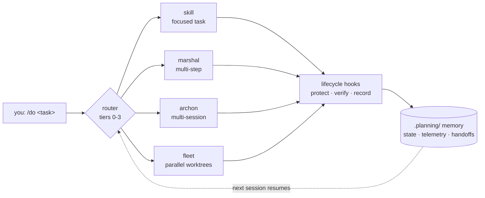
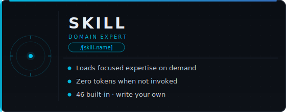
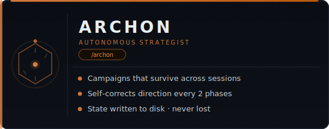

<div align="center">

[](LICENSE)
[](https://github.com/SethGammon/Citadel/actions/workflows/tests.yml)

[](https://github.com/SethGammon/Citadel/stargazers)
[](https://sethgammon.github.io/Citadel/)

**Citadel is an open-source orchestration layer for Claude Code and OpenAI Codex.**

It gives your coding agent durable project memory, `/do` intent routing, safety hooks, cost telemetry, and parallel agents in isolated git worktrees.

If `CLAUDE.md` and `AGENTS.md` tell the runtime **what** your project is, Citadel tells the runtime **how** to operate on it.

[Install](#quick-install) · [See It Run](#see-it-run) · [How It Works](#how-it-works) · [Why It Exists](#why-citadel-exists) · [Roadmap](#roadmap)

</div>

---

## See It Run


> [!NOTE]
> The session above is illustrative, but every step in it is real behavior: the tier cascade, the marshal step chain, the `.planning/` handoff, and `/cost` telemetry. Watch the router animate in the [interactive demo](https://sethgammon.github.io/Citadel/), or run the [copyable demo workflow](DEMO.md) in your own repo.

After installing, try this from your project root:

```text
/do setup --express
/do next
/do review README.md
/do generate tests for the changed files
/cost
```

## What Is Citadel?

Citadel turns one-off coding-agent chats into repeatable engineering workflows. Claude Code and Codex are strong at local reasoning and code edits, but each session still needs project context, safe operating rules, task routing, and a way to continue work after context resets. Citadel is that harness layer.

| | Claude Code / Codex alone | With Citadel |
|---|---|---|
| **Project context** | Re-explained every session | Compiled memory in repo-local `.planning/` files |
| **Choosing a workflow** | You pick review vs. debug vs. refactor | `/do` routes plain English to the lightest capable tool |
| **Long-running work** | Dies with the context window | Campaigns persist, resume, and hand off across sessions |
| **Parallel work** | Manual branch juggling | Fleet agents in isolated worktrees with shared discoveries |
| **Safety rules** | Prompt discipline, re-stated by hand | Lifecycle hooks enforce file protection and quality gates |
| **Token spend** | Guesswork | `/cost` and `/dashboard` from runtime-native telemetry |

## Quick Install

**Prerequisites:** Claude Code or OpenAI Codex, Node.js 18+, and a git repository you want Citadel to manage.

Open your project in Claude Code or Codex and paste this install prompt:

```text
Install Citadel in this repository.

Use https://github.com/SethGammon/Citadel as the source. If a local clone
already exists, reuse it or update it. Detect whether this session is running
in OpenAI Codex or Claude Code. From this project's root, run the matching
Citadel installer and follow any printed plugin enable step.

After Citadel is enabled in a fresh thread, run:

/do setup --express

Use the current repository as the target project. Do not require placeholder
path edits.
```

> [!IMPORTANT]
> After the installer finishes, start a **fresh session** if the runtime asks for one, then run `/do setup --express`. That is the command that matters: it auto-detects the project, installs hooks, scaffolds Citadel state, and gets you to a working `/do` without a tour.

<details>
<summary><strong>Manual install</strong> (run the installer yourself)</summary>

<br>

Clone Citadel once:

```bash
git clone https://github.com/SethGammon/Citadel.git ~/Citadel
```

Then run exactly one installer from the target project root.

For OpenAI Codex:

```bash
node ~/Citadel/scripts/install.js --runtime codex --add-marketplace
```

For Claude Code:

```bash
node ~/Citadel/scripts/install.js --runtime claude --install --scope local
```

Then start a fresh session in the same project and run:

```text
/do setup --express
```

</details>

> [!TIP]
> For a copyable first-run walkthrough, see [DEMO.md](DEMO.md). For runtime-specific details, dry runs, and troubleshooting, see [INSTALL.md](INSTALL.md).

## How It Works

Say what you want. `/do` routes it to the lightest workflow that can handle it.



Classification cascades through four tiers, cheapest first:

- **Tier 0 · Pattern match** - catches trivial commands with regex. Zero tokens, under a millisecond.
- **Tier 1 · Active state** - checks whether you are mid-campaign and resumes it.
- **Tier 2 · Keyword table** - routes known task language to installed skills. Still zero tokens.
- **Tier 3 · LLM classifier** - only when tiers 0-2 miss: analyzes complexity and picks Skill, Marshal, Archon, or Fleet.

Most requests resolve before Tier 3. Whatever runs, the same loop closes around it:



## Orchestration Ladder

Four tiers let Citadel scale from a one-line edit to a multi-session campaign. You never pick one; the router does.

<table>
<tr>
<td width="50%"></td>
<td width="50%"></td>
</tr>
<tr>
<td width="50%"></td>
<td width="50%"></td>
</tr>
</table>

## Core Features

| Capability | What you get | Docs |
|---|---|---|
| **Durable memory** | Campaigns, discoveries, intake, and telemetry live in `.planning/`, so work resumes after a fresh thread or context reset | [Campaigns](docs/CAMPAIGNS.md) |
| **`/do` routing** | Describe the task once; pattern, state, and keyword tiers resolve most requests for zero tokens | [Routing preview](docs/ROUTING_PREVIEW.md) |
| **Safety hooks** | <!-- GENERATED: hook-script-count -->35<!-- /GENERATED --> Node hook scripts across <!-- GENERATED: hook-event-count -->29<!-- /GENERATED --> lifecycle events protect files, gate risky actions, and record handoffs | [Hooks](docs/HOOKS.md) |
| **Cost telemetry** | `/cost` and `/dashboard` show real token usage and session spend instead of guesses | [Reports](docs/REPORT_ARTIFACTS.md) |
| **Operator console** | `/do next` is a decision-first cockpit: current state, next action, risk boundary, verification profile | [Operating loop](docs/OPERATING_LOOP_PROOF.md) |
| **Parallel fleets** | Broad work decomposes across agents in isolated worktrees, with discoveries shared between waves | [Fleet](docs/FLEET.md) |
| **Skills** | <!-- GENERATED: skill-count -->46<!-- /GENERATED --> built-in skills covering review, refactor, tests, QA, telemetry, and setup; write your own in one file | [Skills](docs/SKILLS.md) |
| **Repeatable setup** | Runtime-specific installers plus `/do setup --express` produce the same project state on Codex and Claude Code | [Install](INSTALL.md) |

## Why Citadel Exists

Claude Code and Codex made local agentic development practical. The next problem is operational: making those agents reliable across real projects, repeated sessions, and larger tasks. Without a harness, you keep solving the same coordination problems by hand:

- Re-explaining architecture and project conventions in every session.
- Choosing between review, debugging, refactor, test generation, or planning workflows yourself.
- Losing decisions and discoveries when context compresses or a session ends.
- Manually splitting large tasks across branches or worktrees.
- Rebuilding safety rules, cost checks, and handoff discipline in prompts.

Citadel adds the missing layer around the runtime: persistent state, intent routing, lifecycle enforcement, telemetry, and coordinated multi-agent execution. The priority is reliability over novelty: easier to install, easier to verify, harder to misuse.

## Built in the Open

Everything described above ships in this repository:

- <!-- GENERATED: skill-count -->46<!-- /GENERATED --> skills under [`skills/`](skills/), hook source under [`hooks_src/`](hooks_src/), runtime adapters under [`runtimes/`](runtimes/), installers and verification under [`scripts/`](scripts/).
- Trust boundaries are documented in [SECURITY.md](SECURITY.md) and [THREAT_MODEL.md](THREAT_MODEL.md): local automation risk, generated state, hooks, approval gates, and public-artifact review.
- The [loop contract](docs/LOOP_CONTRACT.md) makes repeated agent workflows inspectable, with shared budgets, verifiers, and stop conditions.
- CI runs the full local verification suite on every push. Run it yourself from a clone:

```bash
npm test
```

## Roadmap

The full plan with exit criteria lives in [docs/ROADMAP.md](docs/ROADMAP.md). The arc: make the harness visible, prove it with numbers, then make it steerable.

- **See It:** a local dashboard over `.planning/` state: campaigns, fleet, loops, hooks, and dual-mode cost (dollars for API users, plan-window burn for subscribers). Spec in [docs/DASHBOARD_SPEC.md](docs/DASHBOARD_SPEC.md).
- **Prove It:** a public, reproducible benchmark page: completion rate and cost on long tasks, bare agent vs harnessed.
- **Drive It:** approvals, steering, and a loop builder in the browser, through the same file contracts the terminal uses.
- **Harden It:** teams-native fleet GA, sandboxed execution profiles, threat model v2, release integrity.
- **Multiply It:** team workflows, a community skill and loop registry, and a third runtime adapter.

## Learn More

- [Install and first run](INSTALL.md) - setup, first-run paths, and troubleshooting for both runtimes
- [Demo workflow](DEMO.md) - copyable operating-loop demo for a real repo
- [Interactive routing demo](https://sethgammon.github.io/Citadel/) - watch the tier cascade animate
- [Routing preview guide](docs/ROUTING_PREVIEW.md) - compare Skill, Marshal, Archon, and Fleet before heavier work
- [Skills reference](docs/SKILLS.md) - all built-in skills with invocation and examples
- [Hooks reference](docs/HOOKS.md) - lifecycle events and enforcement behavior
- [Campaign guide](docs/CAMPAIGNS.md) - persistent state, phases, and handoffs
- [Fleet guide](docs/FLEET.md) - parallel agents, worktree isolation, discovery relay
- [Operating loop proof](docs/OPERATING_LOOP_PROOF.md) - evidence checklist for demos and PRs
- [Skill and memory visibility](docs/SKILL_MEMORY_VISIBILITY.md) - inspect available skills and compiled project memory
- [Public positioning](docs/PUBLIC_POSITIONING.md) - how to describe Citadel without overclaiming
- [Security model](SECURITY.md) - path traversal, shell injection, and defensive measures
- [Contributing](CONTRIBUTING.md) - issues, PRs, skills, and docs

## FAQ

<details>
<summary><strong>Is this for me?</strong></summary>

<br>

If you use Claude Code or Codex on a real repository and keep hitting context loss, repeated setup, weak handoffs, or manual coordination overhead, yes. Citadel is most useful once you have repeated workflows.

</details>

<details>
<summary><strong>How is this different from <code>CLAUDE.md</code> or <code>AGENTS.md</code>?</strong></summary>

<br>

Those files describe your project. Citadel adds the operating layer around the agent: routing, memory, hooks, telemetry, and parallel coordination.

</details>

<details>
<summary><strong>Do I need to learn all <!-- GENERATED: skill-count -->46<!-- /GENERATED --> skills?</strong></summary>

<br>

No. Use `/do` and describe what you want. Direct skill commands are available when you want explicit control.

</details>

<details>
<summary><strong>How much token overhead does it add?</strong></summary>

<br>

Skills cost zero when not loaded. Router tiers 0-2 are local checks; Tier 3 uses a small LLM classification only when needed. Use `/cost` to inspect real usage.

</details>

<details>
<summary><strong>Does it work on Windows?</strong></summary>

<br>

Yes. Hooks and scripts run on Node.js, and the Codex installer includes Windows readiness checks.

</details>

## Community

- [GitHub Discussions](https://github.com/SethGammon/Citadel/discussions) - questions, use cases, bugs, and workflow requests
- [X / Twitter](https://x.com/SethGammon) - project updates

### Star History

<a href="https://www.star-history.com/#SethGammon/Citadel&Date">
  <picture>
    <source media="(prefers-color-scheme: dark)" srcset="https://api.star-history.com/svg?repos=SethGammon/Citadel&type=Date&theme=dark" />
    <source media="(prefers-color-scheme: light)" srcset="https://api.star-history.com/svg?repos=SethGammon/Citadel&type=Date" />
    
  </picture>
</a>

### Contributors

<a href="https://github.com/SethGammon/Citadel/graphs/contributors">
  
</a>

## License

MIT
