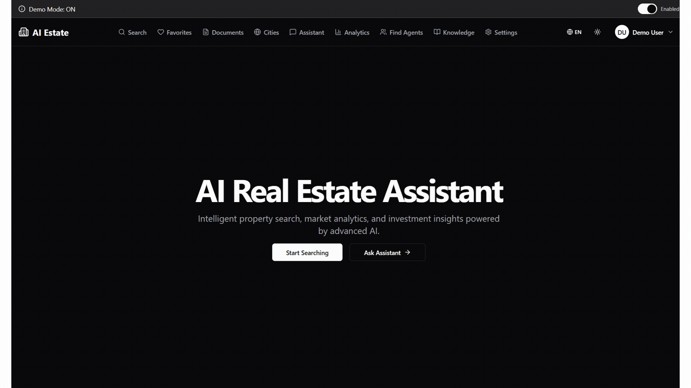
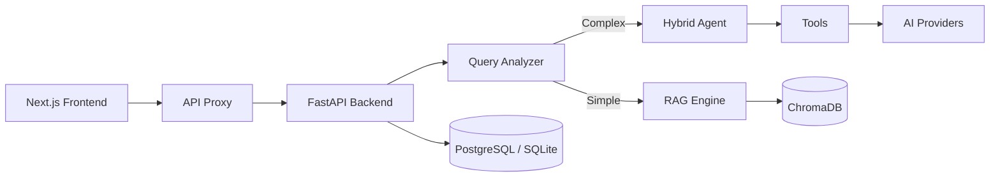

# 🏠 AI Real Estate Assistant

> AI-powered conversational platform for property search, analytics, and market insights.

[](https://python.org)
[](https://fastapi.tiangolo.com/)
[](https://nextjs.org/)
[](https://www.typescriptlang.org/)
[](https://github.com/AleksNeStu/ai-real-estate-assistant/actions/workflows/ci.yml)
[](LICENSE)
[](docs/testing/TESTING_GUIDE.md)
[](https://realestate-web-dz1y.onrender.com/)
[](https://render.com)
[](https://github.com/AleksNeStu/ai-real-estate-assistant/graphs/contributors)
[](https://github.com/AleksNeStu/ai-real-estate-assistant/commits/dev)
[](https://github.com/AleksNeStu/ai-real-estate-assistant/commits/dev)

<!-- markdownlint-disable MD051 -->
## 📑 Table of Contents

- [Live Demo](#-live-demo)
- [Features](#-features)
- [Project Growth](#-project-growth)
- [Architecture](#-architecture)
- [Quick Start](#-quick-start)
- [Testing](#-testing)
- [Documentation](#-documentation)
- [Roadmap](#-roadmap)
- [Branches](#-branches)
- [Deployment](#-deployment)
- [Configuration](#-configuration)
- [Contributing](#-contributing)
- [License](#-license)
<!-- markdownlint-restore -->

## 🌐 Live Demo

<div align="center">

### [**🚀 Try the Live Demo →**](https://realestate-web-dz1y.onrender.com/)

**No login required — explore in demo mode**

</div>

Experience the full power of AI-driven real estate search without any setup:

- 🔍 **Natural Language Property Search** — ask questions like *"2-bedroom apartment in Kraków under 500k"* and get matched listings
- 🤖 **AI-Powered Chat** — conversational interface for finding your perfect property
- 📊 **Financial Tools** — mortgage calculator, rent-vs-buy comparison, ROI analysis, and TCO calculator
- 🗺️ **Interactive Maps** — clustered property markers with area analytics
- 🌍 **9 Languages** — English, Polish, Russian, German, Spanish, Italian, Portuguese, Turkish, and Ukrainian

[](https://realestate-web-dz1y.onrender.com/)
[](https://render.com)

> **Note:** The demo uses simulated AI responses for instant exploration. Production deployment requires API keys.

## 💻 Local Demo Setup

Run the full demo locally with comprehensive mock data in minutes:

```powershell
# Step 1: Launch Docker containers (5-8 min)
.\scripts\demo\01-launch-docker.ps1

# Step 2: Generate comprehensive demo data (2-3 min)
.\scripts\demo\02-generate-data.ps1

# Access the demo
# Frontend: http://localhost:3082
# Backend:  http://localhost:8082
# API Docs: http://localhost:8082/docs
```

**Demo Data Includes:**

- 🏠 250+ properties across 5 Polish cities (Kraków, Warsaw, Gdańsk, Wrocław, Poznań)
- 👥 50 users with different roles
- 🔍 100 saved searches with diverse filters
- ⭐ 200 favorites across users
- 🏢 15 real estate agent profiles
- 📊 150 leads/inquiries
- 📈 300 activity events
- ⚙️ 40 preference profiles
- 📋 20 CMA reports

**Stop the demo:**

```powershell
.\scripts\demo\03-stop-docker.ps1
```

**[→ Demo Setup Documentation](scripts/demo/README.md)** — Complete guide with troubleshooting.

## 📸 Screenshots

<div align="center">



*Homepage · Search · Chat · Agents · Analytics*

</div>

## ✨ Features

### 🤖 Multi-Provider AI
6+ LLM providers with intelligent routing — OpenAI, Anthropic, Google, Grok, DeepSeek, and local Ollama. Automatic fallback chain ensures reliability.

### 🔍 Smart Property Search
Natural language queries with automatic filter extraction. Hybrid semantic + keyword search powered by ChromaDB with MMR reranking for 30-40% better relevance.

### 📊 Analytics & Financial Tools
Mortgage calculator, rent-vs-buy comparison, investment ROI analysis, TCO calculator, and Comparative Market Analysis (CMA) reports.

### 🗺️ Interactive Maps
Mapbox/Leaflet maps with property clustering, area comparisons, and city-overview analytics.

### 🌍 9 Languages
English, Polish, Russian, German, Spanish, Italian, Portuguese, Turkish, and Ukrainian — with EU AI Act compliance labels.

### 🔒 Enterprise Security
OWASP-hardened with rate limiting, audit logging, SSRF protection, and dual-mode auth (API Key + JWT). Progressive 5-stage security pipeline with full scanning on all branches.

## 🛠️ Tech Stack

| Layer | Technology |
|-------|------------|
| Backend API | FastAPI (Python 3.12+) |
| Frontend | Next.js 16 + React 19 |
| Vector DB | ChromaDB (semantic search + MMR reranking) |
| Relational DB | PostgreSQL / SQLite |
| LLM Providers | OpenAI, Anthropic, Google, Grok, DeepSeek, local Ollama |
| Container | Docker / Docker Compose |
| Hosting (staging) | Render free tier |
| CI/CD | GitHub Actions (CI + GHCR + Render deploy) |
| Monitoring | Uptime Kuma + structured logs |

## 📈 Project Growth

### GitHub Stats

[](https://github.com/AleksNeStu/ai-real-estate-assistant)
[](https://github.com/AleksNeStu/ai-real-estate-assistant)
[](https://github.com/AleksNeStu/ai-real-estate-assistant/issues)

### Star Growth

[](https://star-history.com/#AleksNeStu/ai-real-estate-assistant&Date)

### Key Metrics

| Metric           | Value                                       |
| ---------------- | ------------------------------------------- |
| **Commits**      | 1177+                                       |
| **Tests**        | 7,000+ (6,254 backend + 1,000 frontend)     |
| **Lines of Code** | 60,000+ (27K Python + 34K TypeScript)      |
| **Contributors** | 6                                           |
| **Languages**    | 9 supported                                 |

## 🏗️ Architecture



See [docs/architecture/large-saas-overview.md](docs/architecture/large-saas-overview.md) for the full system design.

## 🚀 Quick Start

### PowerShell Scripts (recommended for Windows)

```powershell
# Clone and start demo mode (no API keys required)
git clone https://github.com/AleksNeStu/ai-real-estate-assistant.git
cd ai-real-estate-assistant
.\start-docker.ps1

# Stop: .\stop-docker.ps1
# Logs: .\logs-docker.ps1
```

### Docker (manual)

```bash
git clone https://github.com/AleksNeStu/ai-real-estate-assistant.git
cd ai-real-estate-assistant
cp deploy/compose/.env.example deploy/compose/.env
# Edit deploy/compose/.env — demo mode enabled by default
docker compose -f deploy/compose/docker-compose.yml up --build
# Frontend: http://localhost:3082 · API: http://localhost:8082/docs
```

### Manual

```bash
# Backend
cd apps/api && uv venv .venv && source .venv/bin/activate
uv pip install -e ".[dev]" && python -m uvicorn api.main:app --reload --port 8000

# Frontend
cd apps/web && npm install && npm run dev
# Frontend: http://localhost:3000 · API: http://localhost:8000
```

> **[5-Minute Quickstart →](docs/development/QUICKSTART_5MIN.md)** — Full setup with verification scripts.

## 📁 Project Structure

```text
ai-real-estate-assistant/
├── apps/
│   ├── api/                    # FastAPI backend (Python 3.12+)
│   │   ├── api/                # Routers, main.py, dependencies
│   │   ├── agents/             # HybridAgent, QueryAnalyzer
│   │   ├── tools/              # LangChain tools
│   │   ├── models/             # LLM provider factory
│   │   ├── db/                 # SQLAlchemy models, repositories
│   │   ├── vector_store/       # ChromaDB integration
│   │   └── tests/              # pytest unit/integration/e2e
│   └── web/                    # Next.js 16 frontend (React 19)
│       └── src/
│           ├── app/            # App Router pages
│           ├── components/     # UI components
│           ├── contexts/       # React contexts
│           └── lib/            # API client, utilities
├── deploy/                     # Dockerfiles, compose files, k8s
├── docs/                       # Architecture, API, guides
├── scripts/                    # dev, demo, validation, setup
└── .github/                    # CI/CD, FUNDING, issue templates
```

## 🧪 Testing

### Quick Commands

**Windows:**
```powershell
.\scripts\testing\test-fast.ps1       # ⚡ Quick test (3-5 min) - during development
.\scripts\testing\test-ci.ps1         # 🔍 Full CI (8-12 min) - before commit
.\scripts\testing\test-all.ps1        # 🐛 See all failures - fixing multiple issues
.\scripts\testing\test-coverage.ps1   # 📊 Coverage report - before PR
```

**Linux/macOS:**
```bash
./scripts/testing/test-fast.sh        # ⚡ Quick test (3-5 min)
./scripts/testing/test-ci.sh          # 🔍 Full CI (8-12 min)
./scripts/testing/test-all.sh         # 🐛 See all failures
./scripts/testing/test-coverage.sh    # 📊 Coverage report
```

**See [Testing Guide](docs/testing/TESTING_GUIDE.md) for detailed usage.**

### Test Coverage

| Layer | Tests | Tools | Coverage |
|-------|------:|-------|----------|
| Backend | 6,254+ | pytest, mypy, ruff | 90%+ |
| Frontend | 1,000+ | Jest, ESLint | 80%+ |
| Security | 5 scanners | Gitleaks, Semgrep, Bandit, Trivy, CodeQL | - |
| E2E | WCAG 2.1 AA | axe-core, Playwright | - |

**Performance:** Tests run in parallel using pytest-xdist (local) and GitHub Actions matrix (CI).

## 📖 Documentation

| Doc | Description |
|-----|-------------|
| [Architecture](docs/architecture/large-saas-overview.md) | System design, data flow, deployment |
| [API Reference](docs/api/API_REFERENCE.md) | All endpoints with examples |
| [User Guide](docs/user/USER_GUIDE.md) | How to use the assistant |
| [Contributing](docs/development/CONTRIBUTING.md) | Development workflow |
| [Testing Guide](docs/testing/TESTING_GUIDE.md) | Writing and running tests |
| [CI/CD Pipeline](docs/guides/ci-cd.md) | Progressive security pipeline |
| [Deployment](docs/deployment/DEPLOYMENT.md) | Docker & Render staging |
| [Troubleshooting](docs/development/TROUBLESHOOTING.md) | Common issues |
| [Changelog](CHANGELOG.md) | Version history |

## 🗺️ Roadmap

### Upcoming Features

- **Multi-Tenant Architecture** — Complete data isolation with tenant-aware models and repositories
- **Billing API** — Stripe integration for subscription management and usage-based pricing
- **Market Analytics Dashboard** — Advanced charts and trends for real estate markets
- **Mobile App** — React Native application for iOS and Android
- **Property Comparison Tool** — Side-by-side property analysis
- **Email Notifications** — Alerts for price drops, new listings, and market updates
- **API Rate Limiting** — Per-user quotas and usage analytics

See [GitHub Issues](https://github.com/AleksNeStu/ai-real-estate-assistant/issues) for planned features and discussions.

## 🌿 Branches

| Branch                                                                              | Status    | Description                    |
| ----------------------------------------------------------------------------------- | --------- | ------------------------------ |
| [`dev`](https://github.com/AleksNeStu/ai-real-estate-assistant/tree/dev)            | 🔥 Active | Current development & staging  |
| [`main`](https://github.com/AleksNeStu/ai-real-estate-assistant/tree/main)           | 🟢 Stable  | Stable releases                |

## 🚢 Deployment

- **Staging:** [realestate-web-dz1y.onrender.com](https://realestate-web-dz1y.onrender.com/) — auto-deploys from `dev` branch
- **Production:** deploys from `main` via `deploy.yml` workflow

> **Note:** Render free tier services spin down after inactivity. First visit may take ~30-60s to cold start.

See [Deployment Guide](docs/deployment/DEPLOYMENT.md) for Docker, Render, and Kubernetes setup.

## ⚙️ Configuration

```bash
# Required — at least one LLM provider
OPENAI_API_KEY="sk-..."
ANTHROPIC_API_KEY="sk-ant-..."
GOOGLE_API_KEY="AI..."

# Backend
ENVIRONMENT="local"
CORS_ALLOW_ORIGINS="http://localhost:3000"

# Optional
OLLAMA_BASE_URL="http://localhost:11434"    # Local models
ENABLE_JWT_AUTH="true"                      # User auth
REDIS_URL="redis://localhost:6379"          # Caching
```

See [.env.example](.env.example) for the full list.

## 🤝 Contributing

Contributions are welcome! See [CONTRIBUTING.md](CONTRIBUTING.md) for the workflow.

Please note that this project is released with a [Contributor Code of Conduct](.github/CODE_OF_CONDUCT.md). By participating in this project you agree to abide by its terms.

1. Fork → `git checkout -b feature/short-description`
2. Run checks locally (`make ci`)
3. Commit: `type(scope): message`
4. Open a PR against `dev`

## 📄 License

MIT License — see [LICENSE](LICENSE).

## 💖 Support

If you find this project helpful:

[](https://github.com/sponsors/AleksNeStu)
[](https://www.buymeacoffee.com/AleksNeStu)
[](https://ko-fi.com/AleksNeStu)

### 🏠 Commercial Support

Need deployment help, customization, or CRM integration? Start a [Discussion](https://github.com/AleksNeStu/ai-real-estate-assistant/discussions) with `[Commercial]` prefix.

---

<div align="center">

**⭐ Star this repo if you find it helpful!**

Made with ❤️ using Python, FastAPI, and Next.js

Copyright © 2025-2026 [Alex Nesterovich](https://github.com/AleksNeStu)

</div>
