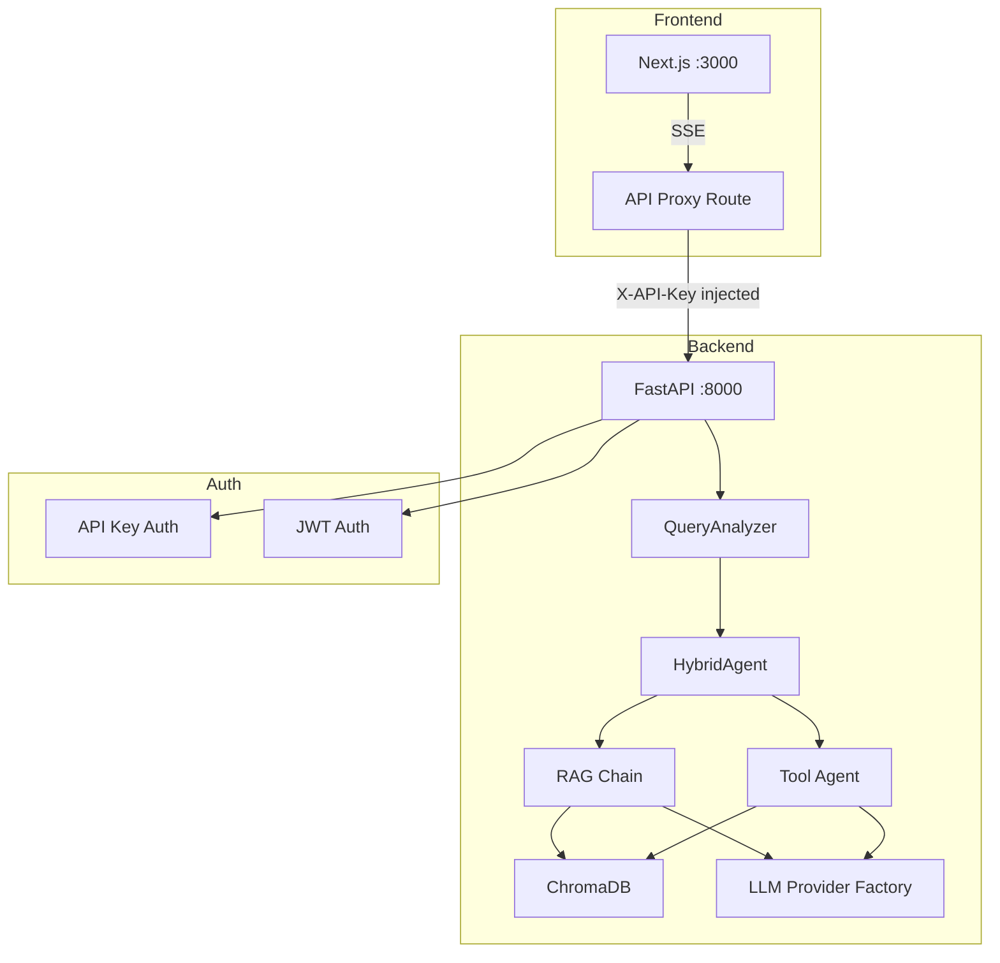

# Architecture Documentation

This directory contains comprehensive documentation for the AI Real Estate Assistant system architecture.

## Overview

The AI Real Estate Assistant is a **conversational AI platform** for property search using:

- **Frontend**: Next.js (React 19) with App Router
- **Backend**: FastAPI (Python 3.12+)
- **AI Engine**: Hybrid Agent (RAG + LangChain Tools)
- **Vector Store**: ChromaDB with FastEmbed embeddings
- **Authentication**: Dual-mode (API Key + JWT)

## Documentation Files

| File | Description |
|------|-------------|
| `request-flow.md` | Complete request flow with Mermaid diagrams |
| `agent-system.md` | QueryAnalyzer and HybridAgent architecture |
| `llm-integration.md` | Multi-provider LLM factory system |
| `vector-store.md` | ChromaDB integration and hybrid retrieval |
| `authentication.md` | API Key and JWT authentication flows |
| `dependency-injection.md` | FastAPI dependency injection patterns |

## System Architecture Diagram

## Key Architectural Patterns

### 1. Hybrid Query Routing

The system uses a **smart query analyzer** to route requests:

| Query Type | Route | Example |
|------------|-------|---------|
| Simple | RAG-only | "What properties in Berlin?" |
| Medium | Hybrid (RAG + enhancement) | "2-bedroom apartments under 500k" |
| Complex | Agent + Tools | "Compare mortgage options for 3 properties" |

### 2. Dependency Injection

All major components are injected via FastAPI's `Depends()`:

- `get_llm()` - Cached LLM with user preference support
- `get_vector_store()` - Cached ChromaPropertyStore
- `get_agent()` - HybridAgent with all dependencies

### 3. Multi-Provider LLM System

Supports 6 LLM providers with automatic fallback:

1. OpenAI (GPT-4o, GPT-4o-mini, etc.)
2. Anthropic (Claude 3.5 Sonnet, Haiku)
3. Google (Gemini Pro)
4. Grok
5. DeepSeek
6. Ollama (local models)

### 4. Dual-Mode Authentication

| Auth Type | Use Case | Header |
|-----------|----------|--------|
| API Key | Backend access, all basic endpoints | `X-API-Key` |
| JWT | User-specific features (favorites, saved searches) | `Authorization: Bearer <token>` |

## Technology Stack

- **Frontend**: Next.js, React 19, TypeScript, Tailwind CSS, Shadcn UI
- **Backend**: FastAPI, Pydantic, SQLAlchemy
- **AI/ML**: LangChain, LangChain Community, ChromaDB, FastEmbed
- **Testing**: Pytest (backend), Jest (frontend)
- **DevOps**: Docker, Docker Compose, GitHub Actions

## Quick Links

- [Developer Setup Guide](../development/README.md)
- [API Documentation](../api/README.md)
- [Testing Guide](../testing/README.md)
- [Deployment Guide](../deployment/README.md)
