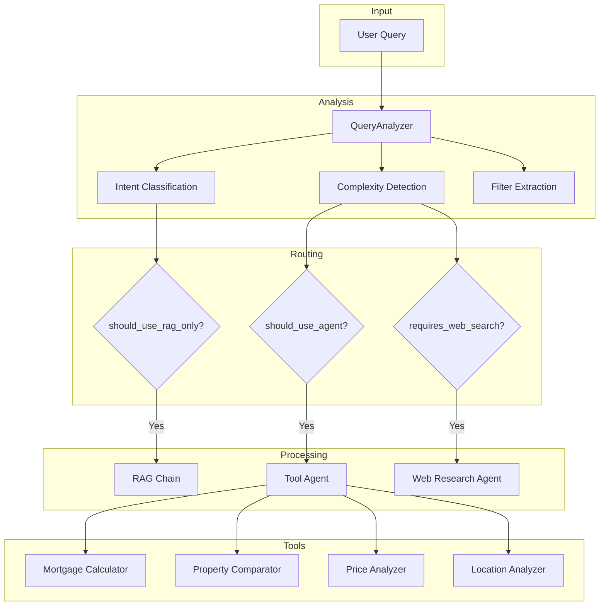
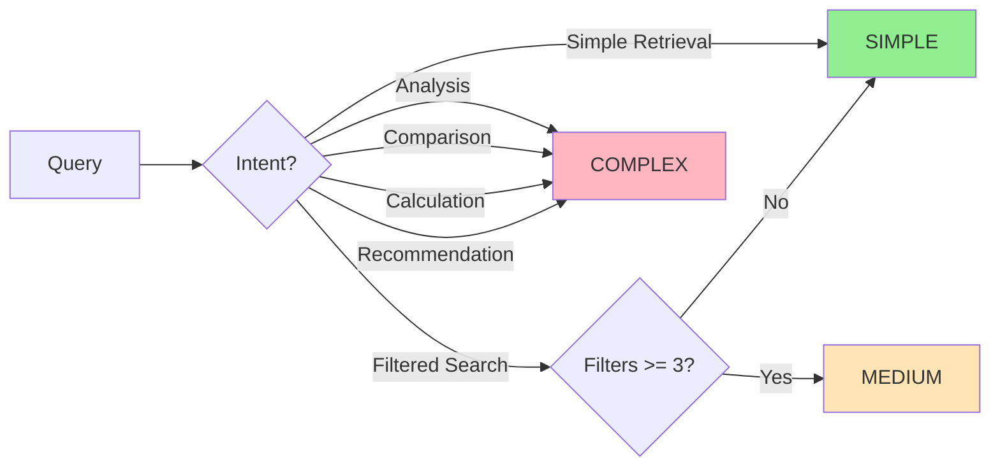
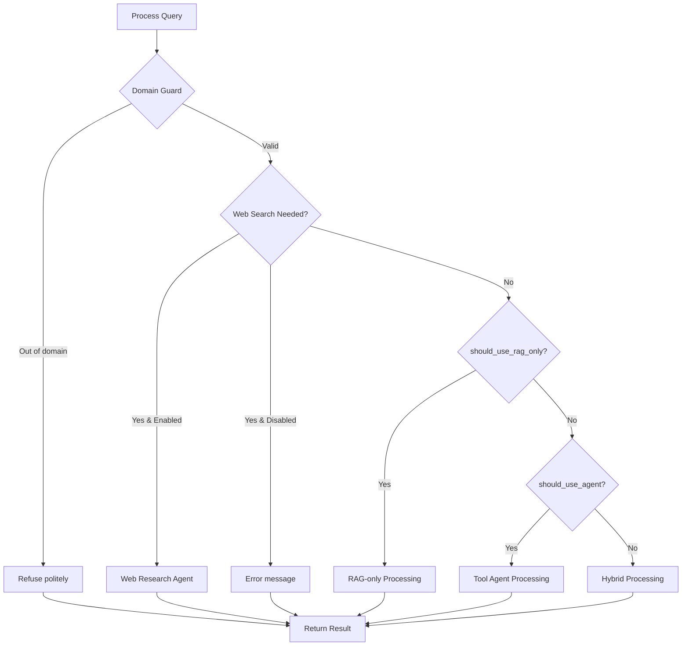
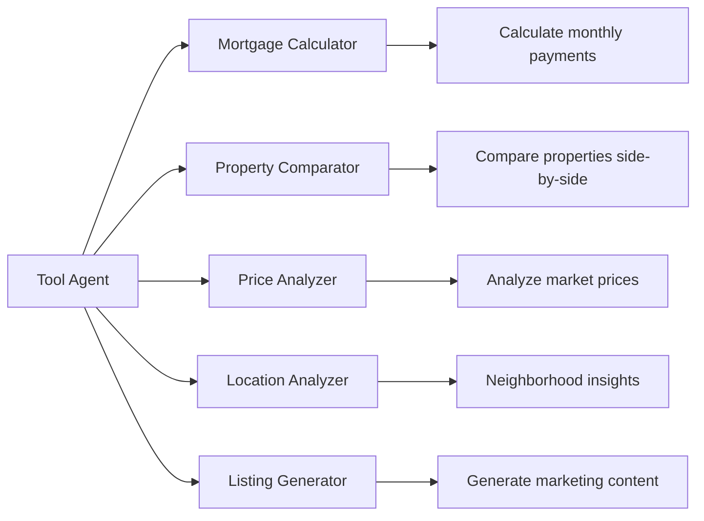
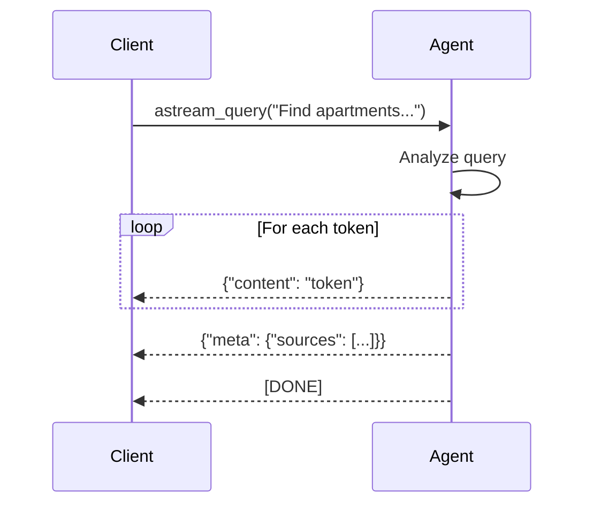

# Agent System

This document describes the AI agent system that powers query understanding and processing.

## Overview

The agent system consists of two main components:

1. **QueryAnalyzer** - Fast, heuristic-based query classification
2. **HybridAgent** - Intelligent routing between RAG and tool-based processing

## Architecture Diagram



## QueryAnalyzer

The `QueryAnalyzer` class provides fast, deterministic query classification without requiring an LLM call.

### Intent Types

| Intent | Description | Example |
|--------|-------------|---------|
| `SIMPLE_RETRIEVAL` | Basic property search | "Show me apartments in Berlin" |
| `FILTERED_SEARCH` | Search with criteria | "2-bedroom apartments under 500k" |
| `COMPARISON` | Compare properties | "Compare Warsaw vs Krakow" |
| `ANALYSIS` | Statistical analysis | "What's the average price per sqm?" |
| `CALCULATION` | Numerical computation | "Calculate mortgage for 200k property" |
| `RECOMMENDATION` | Best option selection | "What's the best value for money?" |
| `CONVERSATION` | Follow-up questions | "Tell me more about that one" |
| `GENERAL_QUESTION` | General real estate | "How does the rental market work?" |

### Complexity Levels



### Filter Extraction

The analyzer extracts structured filters from natural language:

```python
# Input: "Find 2-bedroom apartments in Warsaw under $300,000 with parking"
# Output:
{
    "rooms": 2,
    "city": "Warsaw",
    "max_price": 300000.0,
    "has_parking": True
}
```

Supported filters:
- **Price**: `min_price`, `max_price`
- **Rooms**: `rooms` (number of bedrooms)
- **Location**: `city` (with multilingual support)
- **Year**: `year_built_min`
- **Energy**: `energy_ratings` (A-G)
- **Amenities**: `has_parking`, `has_garden`, `has_pool`, `is_furnished`, `has_elevator`

### Multilingual Support

The analyzer supports English, Russian, and Turkish keywords:

```python
RETRIEVAL_KEYWORDS = [
    "show", "find", "search",  # EN
    "показать", "найти", "поиск",  # RU
    "göster", "bul", "ara",  # TR
]
```

## HybridAgent

The `HybridAgent` orchestrates query processing by routing to the optimal execution strategy.

### Routing Decision Tree



### Processing Strategies

#### 1. RAG-only Processing

Used for simple queries that don't require tools or computation.

```python
def _process_with_rag(query: str, analysis: QueryAnalysis) -> Dict[str, Any]:
    # 1. Retrieve relevant documents
    docs = retriever.get_relevant_documents(query)

    # 2. Generate answer from context
    response = rag_chain({"question": query})

    return {
        "answer": response["answer"],
        "source_documents": response["source_documents"],
        "method": "rag"
    }
```

#### 2. Tool Agent Processing

Used for complex queries requiring computation or multiple steps.

```python
def _process_with_agent(query: str, analysis: QueryAnalysis) -> Dict[str, Any]:
    # 1. Get relevant context (if applicable)
    context_docs = _retrieve_documents(query, analysis)

    # 2. Enhance query with context
    enhanced_query = f"{query}\n\nRelevant properties:\n{context_text}"

    # 3. Execute agent with tools
    response = tool_agent.invoke({"input": enhanced_query})

    return {
        "answer": response["output"],
        "source_documents": context_docs,
        "method": "agent",
        "intermediate_steps": response["intermediate_steps"]
    }
```

#### 3. Hybrid Processing

Combines RAG for retrieval with agent for enhancement.

```python
def _process_hybrid(query: str, analysis: QueryAnalysis) -> Dict[str, Any]:
    # 1. Start with RAG baseline
    rag_response = _process_with_rag(query, analysis)

    # 2. Enhance with agent if needed
    if analysis.requires_computation:
        enhanced_query = (
            f"Based on: {rag_response['answer']}\n\n"
            f"Now answer: {query}"
        )
        agent_response = tool_agent.invoke({"input": enhanced_query})
        answer = agent_response["output"]
    else:
        answer = rag_response["answer"]

    return {"answer": answer, "method": "hybrid"}
```

## LangChain Tools

The agent has access to specialized tools for real estate tasks:



### Tool Examples

**MortgageCalculatorTool**:
```python
def calculate_monthly_payment(
    property_price: float,
    down_payment_percent: float = 20.0,
    interest_rate: float = 4.5,
    loan_years: int = 30
) -> float:
    # Standard mortgage formula
    principal = property_price * (1 - down_payment_percent / 100)
    monthly_rate = interest_rate / 100 / 12
    num_payments = loan_years * 12

    return principal * (monthly_rate * (1 + monthly_rate)**num_payments) / ((1 + monthly_rate)**num_payments - 1)
```

**PropertyComparatorTool**:
```python
def compare_properties(property_ids: List[str]) -> ComparisonResult:
    properties = [get_property(pid) for pid in property_ids]

    return {
        "properties": properties,
        "differences": {
            "price": [p.price for p in properties],
            "area": [p.area for p in properties],
            "rooms": [p.rooms for p in properties],
        },
        "recommendation": recommend_best_value(properties)
    }
```

## Domain Guard

The agent includes a domain guard to:
1. Refuse out-of-domain requests (e.g., cooking recipes)
2. Provide capability information
3. Maintain focus on real estate domain

```python
def _domain_guard(query: str) -> Optional[Dict[str, Any]]:
    # Check for capability questions
    if "what can you do" in query.lower():
        return capability_response()

    # Check for out-of-domain
    if any(kw in query.lower() for kw in OUT_OF_DOMAIN_MARKERS):
        return out_of_domain_response()

    return None  # Process normally
```

## Streaming Support

The agent supports streaming responses for real-time UX:



## Memory Management

The agent maintains conversation memory for context:

```python
class HybridAgent:
    def __init__(self, ...):
        self.memory = ConversationBufferMemory(
            memory_key="chat_history",
            return_messages=True,
            output_key="answer"
        )

    def clear_memory(self) -> None:
        self.memory.clear()

    def get_memory_summary(self) -> str:
        return str(self.memory.load_memory_variables({}))
```

## Configuration

Key configuration options:

| Setting | Default | Description |
|---------|---------|-------------|
| `verbose` | `False` | Enable detailed logging |
| `internet_enabled` | `False` | Enable web search |
| `searxng_url` | `None` | SearXNG instance URL |
| `web_search_max_results` | `5` | Max web search results |
| `web_fetch_timeout_seconds` | `10.0` | Web fetch timeout |

## File Locations

| Component | File |
|-----------|------|
| QueryAnalyzer | `apps/api/agents/query_analyzer.py` |
| HybridAgent | `apps/api/agents/hybrid_agent.py` |
| Property Tools | `apps/api/tools/property_tools.py` |
| Web Research Agent | `apps/api/agents/web_research_agent.py` |
