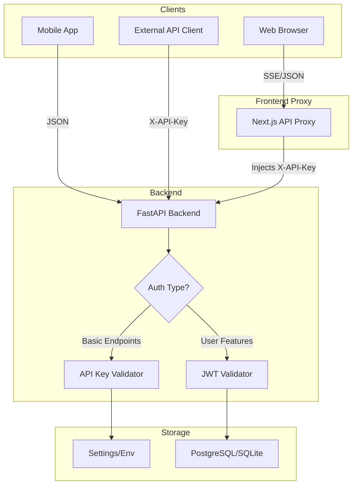
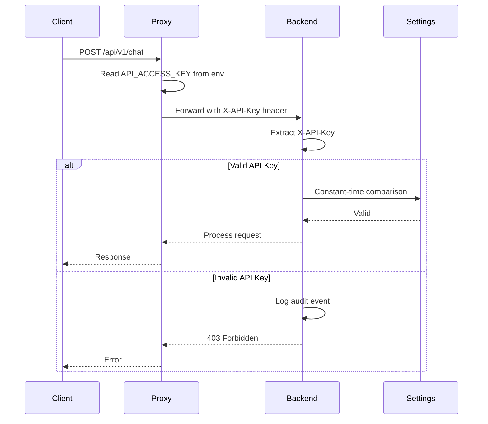
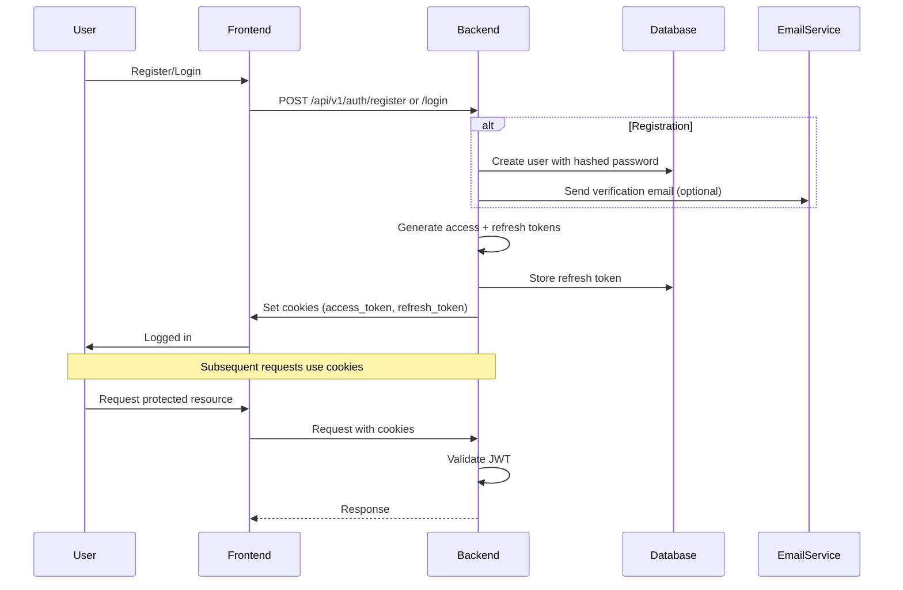
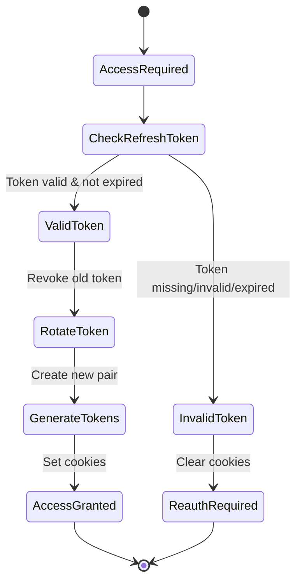
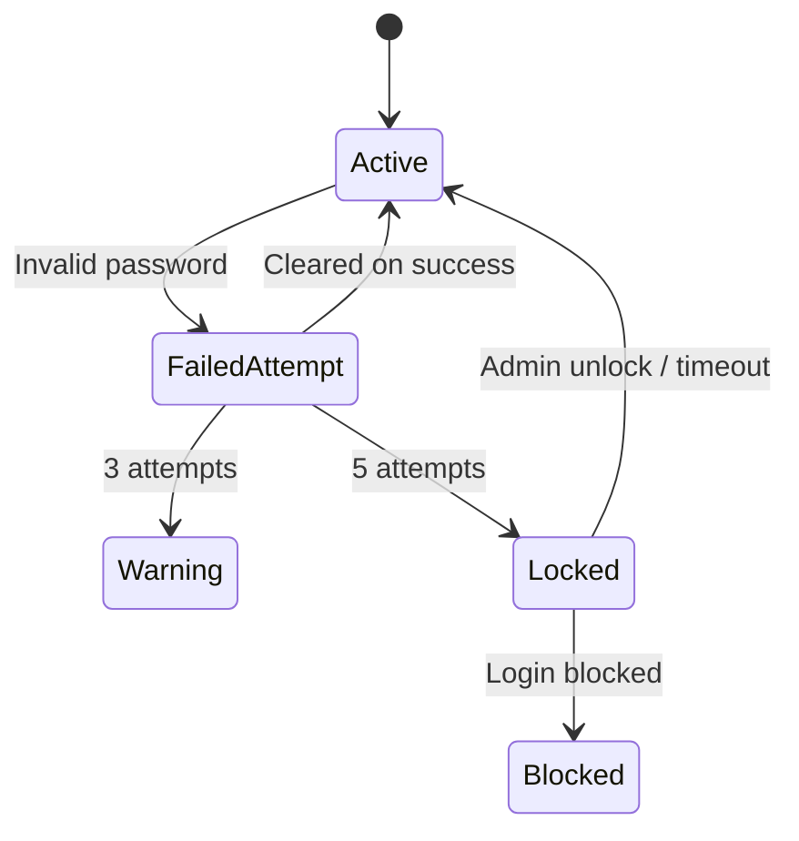
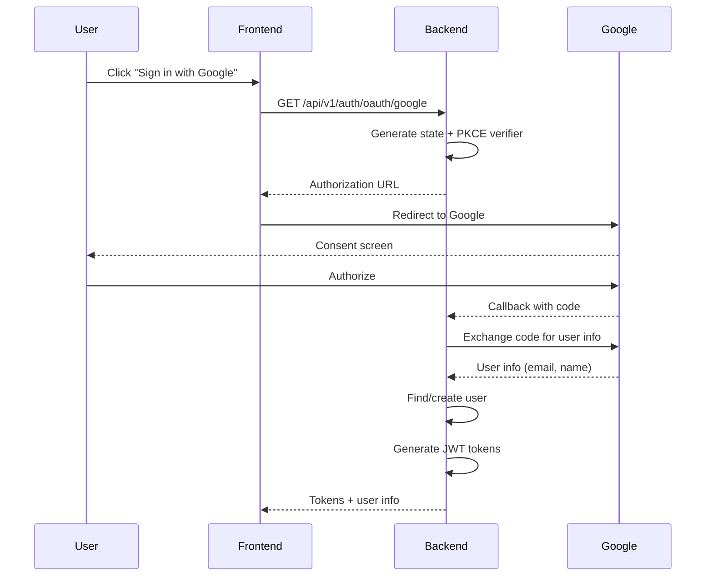

# Authentication System

This document describes the dual-mode authentication system supporting both API Key and JWT authentication.

## Overview

The system uses a **dual-mode authentication** approach:

1. **API Key Authentication** - For backend access and basic endpoints
2. **JWT Authentication** - For user-specific features (favorites, saved searches, etc.)

## Architecture Diagram



## API Key Authentication

Used for backend access and all basic chat/search endpoints.

### Flow Diagram



### Implementation

```python
# apps/api/api/auth.py

import hmac
from fastapi import Security, HTTPException
from fastapi.security.api_key import APIKeyHeader

api_key_header = APIKeyHeader(name="X-API-Key", auto_error=False)

def _is_valid_api_key(candidate: str, valid_keys: list[str]) -> bool:
    """Constant-time comparison of API key candidate against valid keys."""
    for key in valid_keys:
        if key and hmac.compare_digest(candidate, key):
            return True
    return False

async def get_api_key(
    request: Request,
    api_key_header: str = Security(api_key_header),
):
    """Validate API key from header."""
    candidate = api_key_header.strip() if isinstance(api_key_header, str) else ""
    if not candidate:
        raise HTTPException(status_code=401, detail="Invalid credentials")

    settings = get_settings()
    configured_keys = settings.api_access_keys or [settings.api_access_key]

    if _is_valid_api_key(candidate, configured_keys):
        return candidate

    raise HTTPException(status_code=403, detail="Invalid credentials")
```

### Configuration

```bash
# .env
API_ACCESS_KEY=change_me_in_production
API_ACCESS_KEYS=["key1", "key2"]  # Multiple keys (optional)
```

### Security Features

- **Constant-time comparison** using `hmac.compare_digest()` to prevent timing attacks
- **Production safety check** - prevents default keys in production
- **Audit logging** - all auth attempts logged with request IDs

## JWT Authentication

Used for user-specific features like favorites, saved searches, and preferences.

### Flow Diagram



### Token Types

| Token | Lifetime | Usage | Storage |
|-------|----------|-------|---------|
| Access Token | 15-60 minutes | API requests | HttpOnly cookie |
| Refresh Token | 7-30 days | Get new access token | HttpOnly cookie (path restricted) |
| CSRF Token | Matches access token | CSRF protection | Readable cookie |

### JWT Implementation

```python
# core/jwt.py

from datetime import datetime, timedelta
from jose import jwt, JWTError

def create_access_token(subject: str, roles: list[str]) -> str:
    """Create JWT access token."""
    expires_delta = timedelta(minutes=get_access_token_expire_minutes())
    expire = datetime.utcnow() + expires_delta

    to_encode = {
        "sub": str(subject),
        "roles": roles,
        "exp": expire,
        "iat": datetime.utcnow(),
        "type": "access"
    }

    return jwt.encode(to_encode, settings.jwt_secret, algorithm="HS256")

def verify_access_token(token: str) -> Optional[TokenPayload]:
    """Verify JWT access token."""
    try:
        payload = jwt.decode(
            token,
            settings.jwt_secret,
            algorithms=["HS256"]
        )
        return TokenPayload(**payload)
    except JWTError:
        return None
```

### Refresh Token Flow



### Token Rotation

```python
# apps/api/api/routers/auth_jwt.py

@router.post("/refresh")
async def refresh_token(
    refresh_token: Optional[str] = Cookie(default=None),
    session: AsyncSession = Depends(get_db),
):
    """Refresh access token using refresh token."""
    # 1. Validate refresh token from database
    stored_token = await refresh_repo.get_by_token(refresh_token)
    if not stored_token or not stored_token.is_valid:
        raise HTTPException(status_code=401, detail="Invalid refresh token")

    # 2. Get user
    user = await user_repo.get_by_id(stored_token.user_id)

    # 3. Revoke old token (rotation - prevents replay attacks)
    await refresh_repo.revoke(stored_token)

    # 4. Generate new tokens
    new_access_token = create_access_token(subject=user.id, roles=[user.role])
    new_refresh_token = generate_refresh_token()

    # 5. Store new refresh token
    await refresh_repo.create(
        user_id=user.id,
        token=new_refresh_token,
        expires_days=get_refresh_token_expire_days()
    )

    # 6. Set cookies
    _set_auth_cookies(response, new_access_token, new_refresh_token)

    return TokenResponse(access_token=new_access_token, ...)
```

## Account Lockout (Task #47)

The system implements account lockout after failed login attempts:



### Lockout Configuration

```python
# core/lockout.py

class AccountLockoutService:
    MAX_ATTEMPTS = 5
    LOCKOUT_DURATION_MINUTES = 15

    async def check_lockout(self, user: User) -> tuple[bool, int]:
        """Check if account is locked. Returns (is_locked, seconds_remaining)."""
        if user.locked_until and user.locked_until > datetime.utcnow():
            remaining = (user.locked_until - datetime.utcnow()).seconds
            return True, remaining
        return False, 0

    async def record_failed_attempt(self, user: User) -> tuple[bool, int]:
        """Record failed login attempt. Returns (now_locked, seconds_remaining)."""
        user.failed_login_attempts += 1

        if user.failed_login_attempts >= self.MAX_ATTEMPTS:
            user.locked_until = datetime.utcnow() + timedelta(
                minutes=self.LOCKOUT_DURATION_MINUTES
            )
            return True, self.LOCKOUT_DURATION_MINUTES * 60

        return False, 0
```

## OAuth Integration

The system supports OAuth for Google and Apple Sign-In:

### Google OAuth Flow



### OAuth Configuration

```bash
# .env
AUTH_OAUTH_GOOGLE_ENABLED=true
GOOGLE_CLIENT_ID=123456789.apps.googleusercontent.com
GOOGLE_CLIENT_SECRET=GOCSPX-xxxx
GOOGLE_REDIRECT_URI=https://yourapp.com/api/v1/auth/oauth/callback

AUTH_OAUTH_APPLE_ENABLED=true
APPLE_CLIENT_ID=com.yourapp.app
APPLE_TEAM_ID=ABCD1234
APPLE_KEY_ID=EFGH5678
APPLE_PRIVATE_KEY_PATH=/path/to/key.pem
```

## Security Features

### Rate Limiting

```python
# Per-endpoint rate limiting
@auth_rate_limit(max_requests=5, window_seconds=60)
async def login(...):
    """Limit to 5 login attempts per minute per IP."""
```

### Password Security

```python
# core/password.py

import bcrypt

def hash_password(password: str) -> str:
    """Hash password using bcrypt."""
    salt = bcrypt.gensalt()
    return bcrypt.hashpw(password.encode(), salt).decode()

def verify_password(password: str, hashed: str) -> bool:
    """Verify password against hash."""
    return bcrypt.checkpw(password.encode(), hashed.encode())

def needs_rehash(hashed_password: str) -> bool:
    """Check if password needs rehashing (algorithm upgrade)."""
    return bcrypt.checkpw(b"", hashed_password.encode()) is False
```

### CSRF Protection

```python
# Double-submit cookie pattern
def _set_auth_cookies(response, access_token, refresh_token, csrf_token):
    response.set_cookie("csrf_token", csrf_token, httponly=False)
    response.set_cookie("access_token", access_token, httponly=True)

# On request, verify CSRF token matches
def verify_csrf(request):
    cookie_token = request.cookies.get("csrf_token")
    header_token = request.headers.get("X-CSRF-Token")
    return hmac.compare_digest(cookie_token, header_token)
```

## Audit Logging

All authentication events are logged:

```python
# api/audit.py

audit_logger.log(
    AuditEvent(
        event_type=AuditEventType.AUTH_LOGIN_SUCCESS,
        level=AuditLevel.MEDIUM,
        user_id=user.id,
        resource="/auth/login",
        action="login",
        result="success",
        ip_address=ip_address,
    )
)
```

## Protected vs Public Endpoints

| Endpoint | Auth Required | Type |
|----------|---------------|------|
| `/api/v1/chat` | API Key | Basic |
| `/api/v1/search` | API Key | Basic |
| `/api/v1/rag/*` | API Key | Basic |
| `/api/v1/favorites` | JWT | User |
| `/api/v1/saved-searches` | JWT | User |
| `/api/v1/auth/*` | Mixed | Auth |
| `/api/v1/admin/*` | JWT + Admin role | Admin |

## File Locations

| Component | File |
|-----------|------|
| API Key Auth | `apps/api/api/auth.py` |
| JWT Endpoints | `apps/api/api/routers/auth_jwt.py` |
| JWT Core | `apps/api/core/jwt.py` |
| Password | `apps/api/core/password.py` |
| Lockout | `apps/api/core/lockout.py` |
| OAuth | `apps/api/core/oauth.py` |
| Audit | `apps/api/api/audit.py` |
| Auth Dependencies | `apps/api/api/deps/auth.py` |
