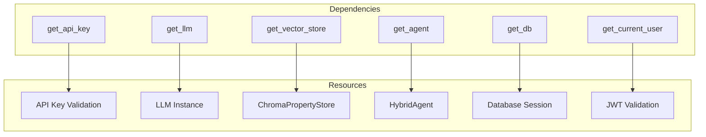
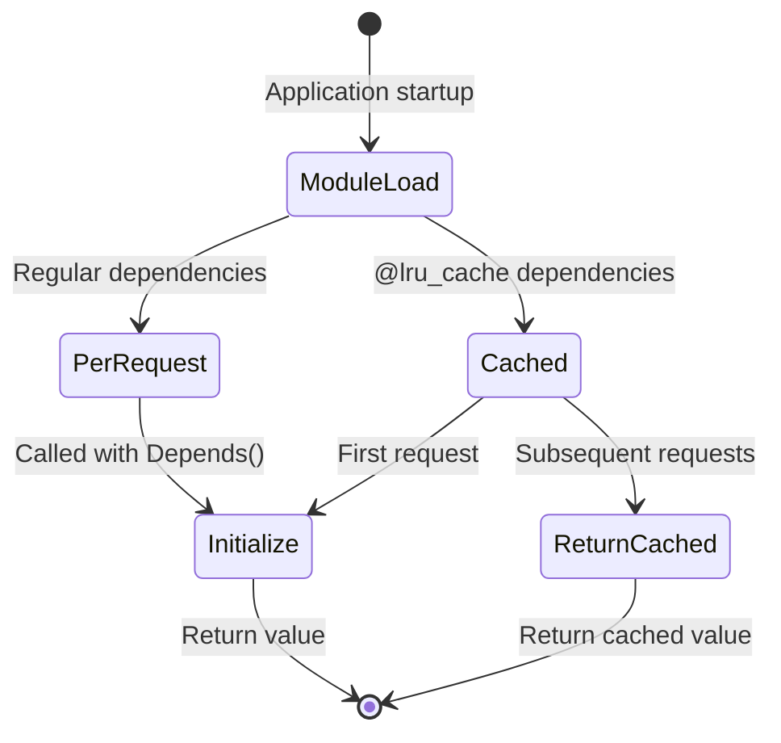
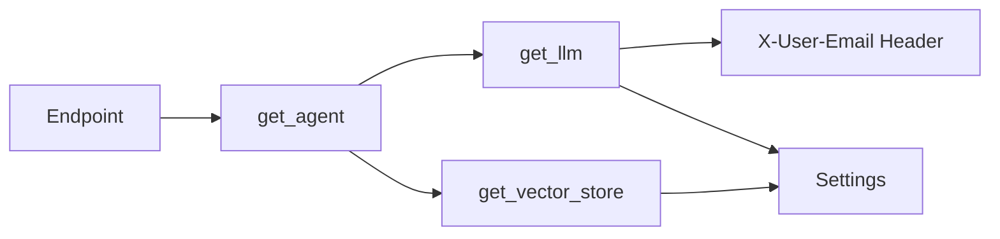

# Dependency Injection

This document describes FastAPI's dependency injection system used throughout the backend.

## Overview

The system uses FastAPI's `Depends()` for all major components, enabling:

- **Testability** - Easy to mock dependencies in tests
- **Caching** - Expensive resources are cached automatically
- **Clean code** - No manual initialization in endpoints
- **Type safety** - Full type checking with mypy

## Key Dependencies



## Dependency Lifecycle



## Core Dependencies

### API Key Authentication

```python
# apps/api/api/auth.py

api_key_header = APIKeyHeader(name="X-API-Key", auto_error=False)

async def get_api_key(
    request: Request,
    api_key_header: str = Security(api_key_header),
) -> str:
    """Validate API key from header."""
    # ... validation logic
    return valid_key
```

**Usage**:
```python
@router.post("/chat")
async def chat(
    request: ChatRequest,
    api_key: str = Depends(get_api_key),  # Injected
):
    # api_key is automatically validated
    pass
```

### LLM Provider

```python
# apps/api/api/dependencies.py

def get_llm(
    x_user_email: Annotated[str | None, Header(alias="X-User-Email")] = None,
) -> BaseChatModel:
    """Get Language Model instance with user preference support."""
    # Respects user preferences, settings, and fallbacks
    return _create_llm(provider, model)
```

**Usage**:
```python
@router.post("/chat")
async def chat(
    request: ChatRequest,
    api_key: str = Depends(get_api_key),
    llm: BaseChatModel = Depends(get_llm),  # Injected with user prefs
):
    agent = create_agent(llm=llm)
    return agent.process_query(request.message)
```

### Vector Store (Cached)

```python
# apps/api/api/dependencies.py

@lru_cache()
def get_vector_store() -> Optional[ChromaPropertyStore]:
    """Get cached vector store instance."""
    if ChromaPropertyStore is None:
        return None
    try:
        store = ChromaPropertyStore(
            persist_directory=str(settings.chroma_dir),
            collection_name="properties",
            embedding_model=settings.embedding_model,
        )
        return store
    except Exception:
        return None
```

**Usage**:
```python
@router.post("/search")
async def search(
    request: SearchRequest,
    api_key: str = Depends(get_api_key),
    store: ChromaPropertyStore = Depends(get_vector_store),  # Cached
):
    retriever = store.get_retriever()
    return retriever.get_relevant_documents(request.query)
```

### Agent Factory

```python
# apps/api/api/dependencies.py

def get_agent(
    store: Annotated[Optional[ChromaPropertyStore], Depends(get_vector_store)],
    llm: Annotated[BaseChatModel, Depends(get_llm)],
) -> Any:
    """Get initialized Hybrid Agent."""
    if not store:
        raise RuntimeError("Vector Store unavailable")

    retriever = store.get_retriever()
    return create_hybrid_agent(llm=llm, retriever=retriever)
```

**Usage**:
```python
@router.post("/chat")
async def chat(
    request: ChatRequest,
    api_key: str = Depends(get_api_key),
    agent: Any = Depends(get_agent),  # Fully initialized
):
    return agent.process_query(request.message)
```

### Database Session

```python
# apps/api/db/database.py

async def get_db() -> AsyncGenerator[AsyncSession, None]:
    """Get database session."""
    async_session_maker = async_sessionmaker(
        bind=engine,
        class_=AsyncSession,
        expire_on_commit=False,
    )
    async with async_session_maker() as session:
        try:
            yield session
        finally:
            await session.close()
```

**Usage**:
```python
@router.post("/auth/register")
async def register(
    body: UserCreate,
    session: AsyncSession = Depends(get_db),  # Injected
):
    user_repo = UserRepository(session)
    user = await user_repo.create(...)
    return user
```

### JWT User

```python
# apps/api/api/deps/auth.py

async def get_current_user(
    token: str = Depends(oauth2_scheme),
    session: AsyncSession = Depends(get_db),
) -> User:
    """Get current authenticated user from JWT."""
    payload = verify_access_token(token)
    if not payload:
        raise HTTPException(status_code=401, detail="Invalid token")

    user_repo = UserRepository(session)
    user = await user_repo.get_by_id(payload.sub)
    if not user or not user.is_active:
        raise HTTPException(status_code=401, detail="User not found")

    return user
```

**Usage**:
```python
@router.get("/favorites")
async def get_favorites(
    user: User = Depends(get_current_user),  # Injected
):
    return user.favorites
```

## Dependency Chaining

Dependencies can depend on other dependencies:



**Example**:
```python
# get_agent depends on get_llm and get_vector_store
def get_agent(
    store: Annotated[Optional[ChromaPropertyStore], Depends(get_vector_store)],
    llm: Annotated[BaseChatModel, Depends(get_llm)],
) -> Any:
    return create_hybrid_agent(llm=llm, retriever=store.get_retriever())

# Endpoint only needs to depend on get_agent
@router.post("/chat")
async def chat(
    agent: Any = Depends(get_agent),  # Handles all dependencies
):
    return agent.process_query(query)
```

## Testing with Dependencies

FastAPI makes testing easy by allowing dependency overrides:

```python
# tests/conftest.py

from fastapi.testclient import TestClient
from apps.api.main import app

@pytest.fixture
def async_client():
    """Create test client with async support."""
    from httpx import AsyncClient, ASGITransport

    async def override_get_db():
        # Use test database
        async with TestingSessionLocal() as session:
            yield session

    async def override_get_api_key():
        # Bypass auth in tests
        return "test-api-key"

    async def override_get_llm():
        # Mock LLM
        return MockLLM()

    app.dependency_overrides[get_db] = override_get_db
    app.dependency_overrides[get_api_key] = override_get_api_key
    app.dependency_overrides[get_llm] = override_get_llm

    async with AsyncClient(transport=ASGITransport(app=app), base_url="http://test") as client:
        yield client

    app.dependency_overrides.clear()
```

## Optional Dependencies

For non-critical dependencies, use optional patterns:

```python
def get_optional_llm(
    x_user_email: Annotated[str | None, Header(alias="X-User-Email")] = None,
) -> Optional[BaseChatModel]:
    """Get LLM or return None if unavailable."""
    try:
        return get_llm(x_user_email=x_user_email)
    except Exception as e:
        logger.warning("LLM unavailable: %s", e)
        return None

# Usage with graceful fallback
@router.post("/chat")
async def chat(
    llm: Optional[BaseChatModel] = Depends(get_optional_llm),
):
    if llm is None:
        return {"answer": "LLM service temporarily unavailable"}
    return process_with_llm(llm)
```

## Custom Dependency Classes

Create reusable dependency classes:

```python
# apps/api/api/deps/rate_limit.py

class RateLimitDepends:
    """Rate limiting dependency."""

    def __init__(self, max_requests: int, window_seconds: int = 60):
        self.max_requests = max_requests
        self.window_seconds = window_seconds

    def __call__(self, request: Request) -> None:
        client_ip = self._get_client_ip(request)
        if not self._check_rate_limit(client_ip):
            raise HTTPException(
                status_code=429,
                detail="Too many requests"
            )

# Usage
@router.post("/chat")
async def chat(
    _rate_limit: None = Depends(RateLimitDepends(max_requests=10)),
):
    return {"message": "ok"}
```

## Performance Considerations

| Dependency | Strategy | Rationale |
|------------|----------|-----------|
| `get_vector_store` | `@lru_cache()` | Expensive initialization |
| `get_llm` | Per-request | User preferences vary |
| `get_db` | Generator | Connection pooling |
| `get_api_key` | Per-request | Security validation |
| `get_agent` | Per-request | Depends on LLM |

## File Locations

| Component | File |
|-----------|------|
| Main Dependencies | `apps/api/api/dependencies.py` |
| Auth Dependencies | `apps/api/api/deps/auth.py` |
| API Key Auth | `apps/api/api/auth.py` |
| Database | `apps/api/db/database.py` |
| Test Overrides | `apps/api/tests/conftest.py` |
