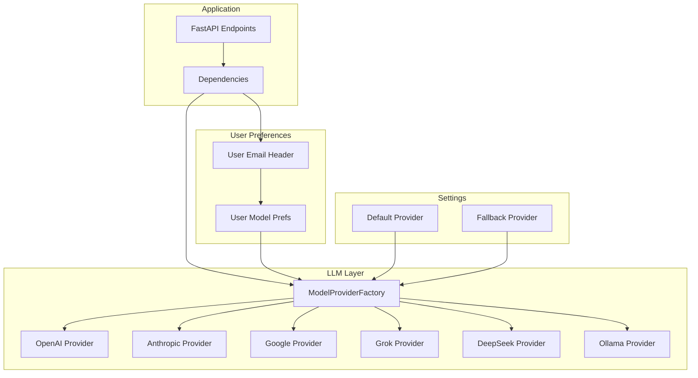
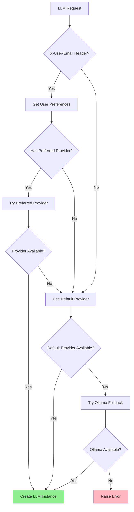

# LLM Integration

This document describes the multi-provider Language Model integration system.

## Overview

The system uses a factory pattern to support multiple LLM providers with automatic fallback and user preference support.

## Architecture Diagram



## Provider Selection Logic

The system uses a priority chain for provider selection:



### Selection Priority

1. **User Email Preference** (via `X-User-Email` header)
2. **Request Parameter Override** (explicit `provider`/`model` params)
3. **Settings Default** (`DEFAULT_PROVIDER`, `DEFAULT_MODEL`)
4. **Ollama Fallback** (if `OLLAMA_BASE_URL` configured)

## Supported Providers

### OpenAI

| Model | Context | Use Case |
|-------|---------|----------|
| gpt-4o | 128K | General purpose |
| gpt-4o-mini | 128K | Fast, cost-effective |
| o1-preview | 128K | Complex reasoning |
| o1-mini | 128K | Fast reasoning |

```python
# Configuration
OPENAI_API_KEY=sk-...
DEFAULT_PROVIDER=openai
DEFAULT_MODEL=gpt-4o
```

### Anthropic Claude

| Model | Context | Use Case |
|-------|---------|----------|
| claude-3-5-sonnet-20241022 | 200K | Long context |
| claude-3-5-haiku-20241022 | 200K | Fast responses |

```python
# Configuration
ANTHROPIC_API_KEY=sk-ant-...
```

### Google Gemini

| Model | Context | Use Case |
|-------|---------|----------|
| gemini-2.0-flash-exp | 1M | Large context |
| gemini-exp-1206 | 1M | Experimental |

```python
# Configuration
GOOGLE_API_KEY=AI...
```

### Grok

```python
# Configuration
GROK_API_KEY=xai-...
```

### DeepSeek

```python
# Configuration
DEEPSEEK_API_KEY=sk-...
```

### Ollama (Local)

Open-source local models:

| Model | Parameters | Use Case |
|-------|------------|----------|
| llama3.2 | 3B, 11B, 90B | General purpose |
| mistral | 7B | Fast, efficient |
| codellama | 7B, 13B, 34B | Code generation |

```python
# Configuration
OLLAMA_BASE_URL=http://localhost:11434
OLLAMA_DEFAULT_MODEL=llama3.2
```

## ModelProviderFactory

The factory provides a unified interface for all providers:

```python
class ModelProviderFactory:
    _PROVIDERS: Dict[str, Type[ModelProvider]] = {
        "openai": OpenAIProvider,
        "anthropic": AnthropicProvider,
        "google": GoogleProvider,
        "grok": GrokProvider,
        "deepseek": DeepSeekProvider,
        "ollama": OllamaProvider,
    }
```

### Factory Methods

```python
# List all providers
providers = ModelProviderFactory.list_providers()
# ['openai', 'anthropic', 'google', 'grok', 'deepseek', 'ollama']

# Get a specific provider
provider = ModelProviderFactory.get_provider("openai")

# List all models from all providers
models = ModelProviderFactory.list_all_models()

# Create a model by ID
llm = ModelProviderFactory.create_model(
    model_id="gpt-4o",
    temperature=0.7,
    max_tokens=4096
)

# Get provider availability
status = ModelProviderFactory.get_available_providers()
# [('openai', True, None), ('anthropic', False, 'API key missing'), ...]
```

## Dependency Integration

LLM instances are injected via FastAPI dependencies:

```python
# apps/api/api/dependencies.py

def get_llm(
    x_user_email: Annotated[str | None, Header(alias="X-User-Email")] = None,
) -> BaseChatModel:
    """Get Language Model instance with user preference support."""
    default_provider = settings.default_provider
    default_model = settings.default_model

    # Try user preference
    if x_user_email:
        prefs = MODEL_PREFS_MANAGER.get_preferences(x_user_email)
        if prefs.preferred_provider:
            try:
                return _create_llm(prefs.preferred_provider, prefs.preferred_model)
            except Exception:
                pass  # Fall back to default

    # Use default
    return _create_llm(default_provider, default_model)
```

### Usage in Endpoints

```python
@router.post("/api/v1/chat")
async def chat(
    request: ChatRequest,
    llm: BaseChatModel = Depends(get_llm),
    api_key: str = Depends(get_api_key),
):
    # llm is automatically initialized with user preferences
    agent = get_agent(llm=llm)
    result = agent.process_query(request.message)
    return result
```

## User Model Preferences

Users can store their preferred provider and model:

```python
# apps/api/models/user_model_preferences.py

class ModelPreferences(BaseModel):
    email: str
    preferred_provider: Optional[str] = None
    preferred_model: Optional[str] = None

# Set preferences
MODEL_PREFS_MANAGER.set_preferences(
    email="user@example.com",
    provider="anthropic",
    model="claude-3-5-sonnet-20241022"
)

# Get preferences
prefs = MODEL_PREFS_MANAGER.get_preferences("user@example.com")
```

## LLM Configuration

### Temperature and Tokens

```python
# config/settings.py

default_temperature: float = 0.7
default_max_tokens: int = 4096

# Per-request override
llm = ModelProviderFactory.create_model(
    model_id="gpt-4o",
    temperature=0.3,  # More deterministic
    max_tokens=8192,  # Longer responses
)
```

### Streaming Support

All providers support streaming responses:

```python
llm = ModelProviderFactory.create_model(
    model_id="gpt-4o",
    streaming=True
)

for chunk in llm.stream("Hello, world!"):
    print(chunk.content)
```

## Model Information

Each model provides metadata:

```python
class ModelInfo(BaseModel):
    id: str
    display_name: str
    provider_name: str
    context_window: int
    capabilities: List[ModelCapability]
    pricing: Optional[PricingInfo] = None
    description: Optional[str] = None
    recommended_for: List[str] = []

# Example
info = ModelInfo(
    id="gpt-4o",
    display_name="GPT-4o",
    provider_name="openai",
    context_window=128000,
    capabilities=[ModelCapability.VISION, ModelCapability.FUNCTION_CALLING],
    pricing=PricingInfo(
        input_price_per_1m=2.50,
        output_price_per_1m=10.00
    ),
    recommended_for=["chat", "vision", "tools"]
)
```

## Error Handling

The system gracefully handles provider failures:

```python
try:
    llm = get_llm(x_user_email="user@example.com")
except RuntimeError as e:
    # All providers failed
    return {"error": "LLM service unavailable"}
```

### Provider Validation

Each provider validates its connection:

```python
provider = ModelProviderFactory.get_provider("openai")
is_valid, error = provider.validate_connection()

if not is_valid:
    logger.warning(f"OpenAI provider unavailable: {error}")
    # Try fallback provider
```

## Performance Optimization

### Provider Caching

Provider instances are cached by default:

```python
# First call creates instance
provider1 = ModelProviderFactory.get_provider("openai")

# Subsequent calls return cached instance
provider2 = ModelProviderFactory.get_provider("openai")

# provider1 is provider2
assert provider1 is provider2
```

### Bypass Cache

```python
# Create fresh instance with new config
provider = ModelProviderFactory.get_provider(
    "openai",
    config={"api_key": "new-key"},
    use_cache=False
)
```

## File Locations

| Component | File |
|-----------|------|
| Factory | `apps/api/models/provider_factory.py` |
| Base Provider | `apps/api/models/providers/base.py` |
| OpenAI | `apps/api/models/providers/openai.py` |
| Anthropic | `apps/api/models/providers/anthropic.py` |
| Google | `apps/api/models/providers/google.py` |
| Ollama | `apps/api/models/providers/ollama.py` |
| User Prefs | `apps/api/models/user_model_preferences.py` |
| Dependencies | `apps/api/api/dependencies.py` |
