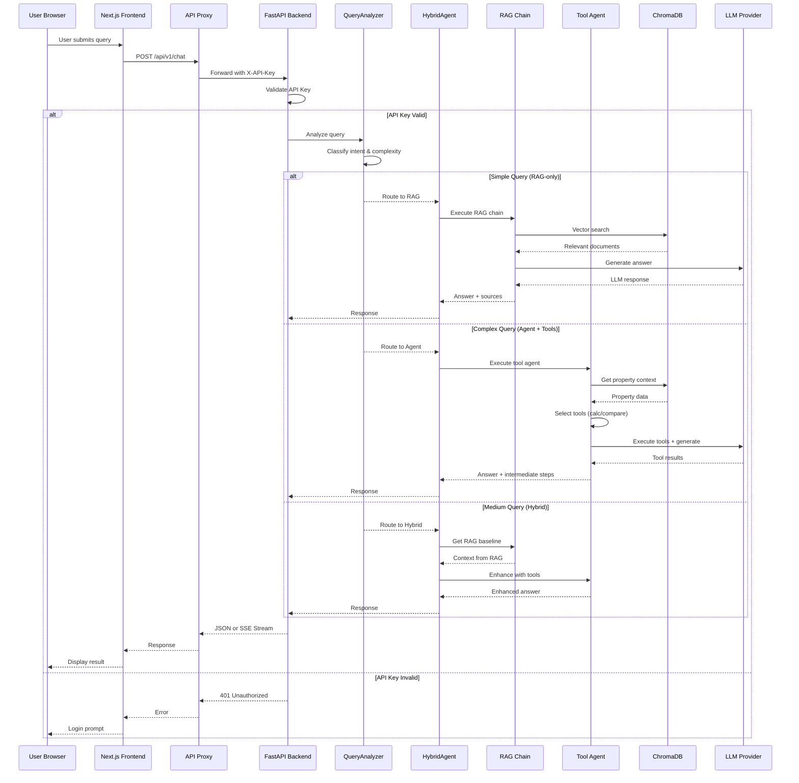
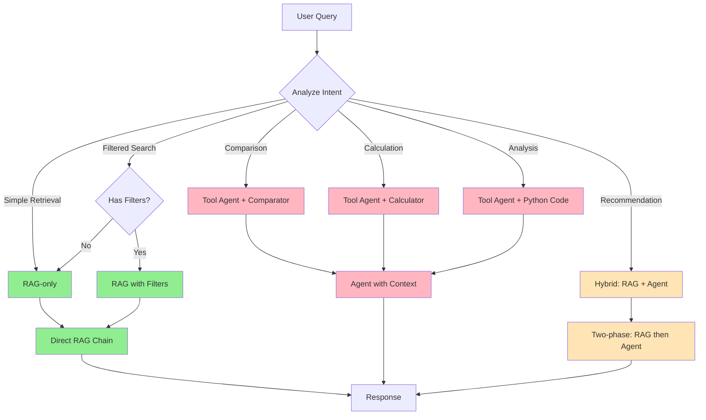
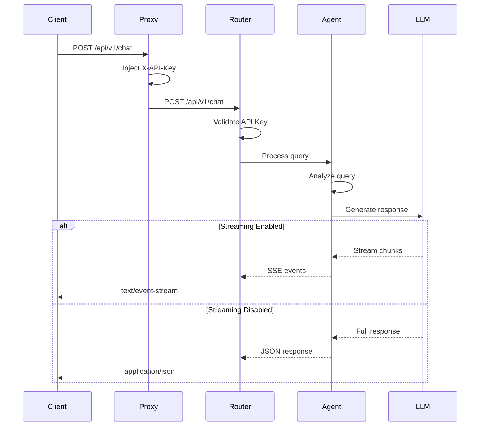
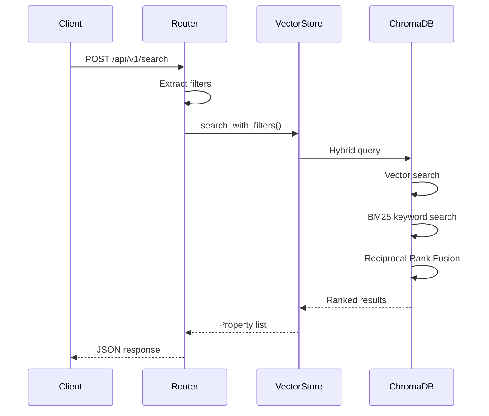
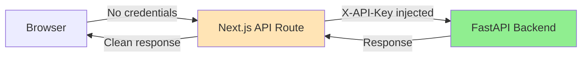
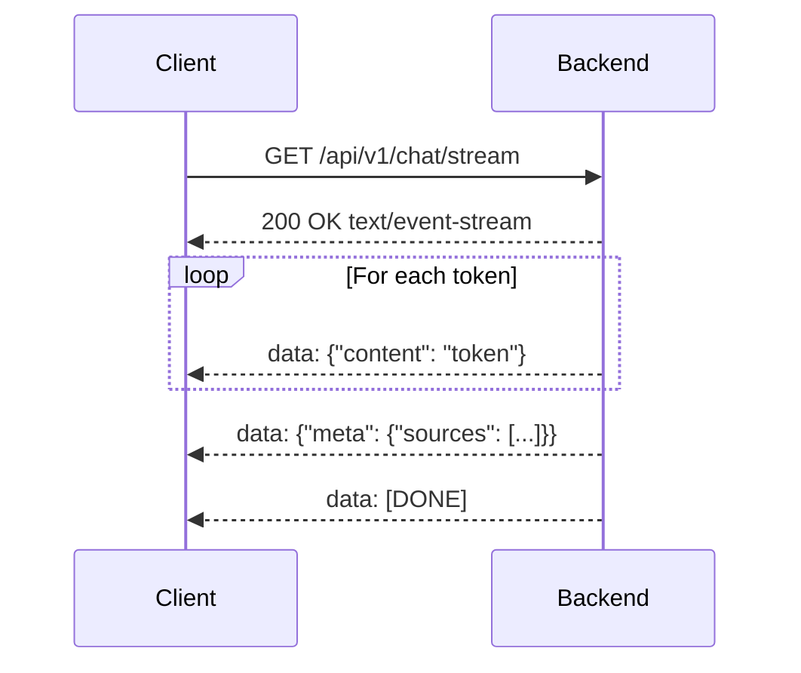
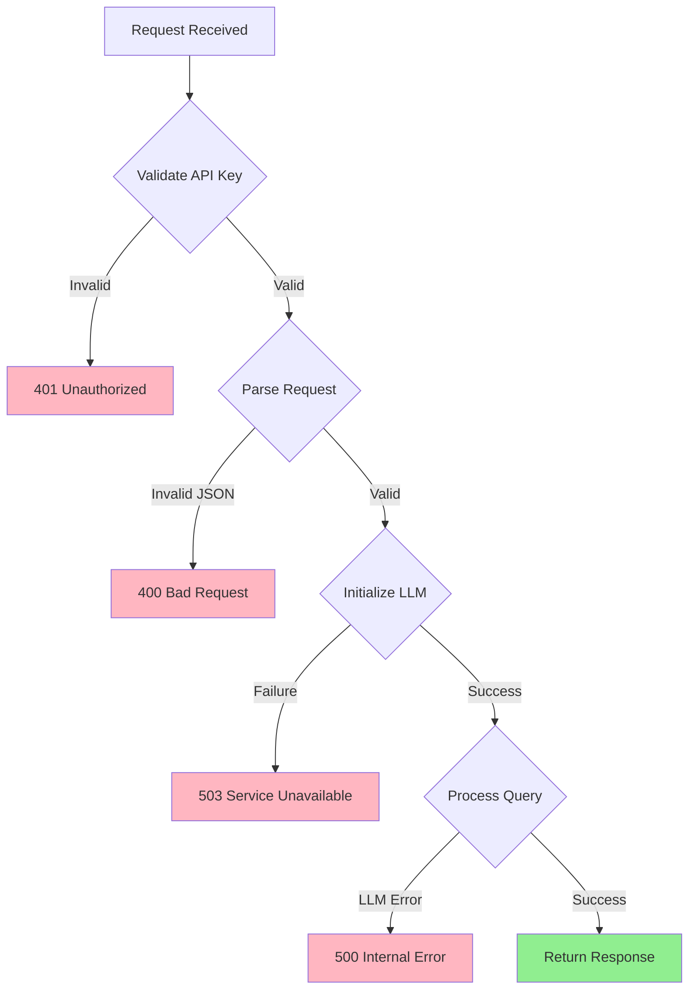

# Request Flow

This document describes the complete request flow through the AI Real Estate Assistant system.

## Overview

The request flow follows this pattern:

```
User Browser -> Next.js Frontend -> API Proxy -> FastAPI Backend -> Query Analysis -> Processing -> Response
```

## Complete Request Flow Diagram



## Query Routing Logic

The `QueryAnalyzer` class determines the optimal processing strategy:



## API Endpoint Flows

### Chat Endpoint (`/api/v1/chat`)



### Search Endpoint (`/api/v1/search`)



## Frontend API Proxy Pattern

The frontend uses an API proxy to keep credentials server-side:



**File**: `apps/web/src/app/api/v1/[...path]/route.ts`

## Streaming Response Flow

For real-time chat responses, the system uses Server-Sent Events:



## Error Handling Flow



## Request State Management

Each request is tracked with:

1. **Request ID**: Unique identifier for tracing
2. **Audit Log**: All auth events logged
3. **Timing**: Request duration tracking
4. **Response Meta**: Sources, method used, intent

### Response Structure

```typescript
interface ChatResponse {
  answer: string;
  source_documents: Document[];
  method: 'rag' | 'agent' | 'hybrid' | 'web_search';
  intent: string;
  intermediate_steps?: any[];
  analysis?: QueryAnalysis;
}
```

## Performance Considerations

| Operation | Typical Latency | Optimization |
|-----------|-----------------|--------------|
| API Key Validation | < 5ms | Constant-time comparison |
| Query Analysis | < 10ms | Heuristic-based (no LLM) |
| Vector Search | 50-200ms | ChromaDB caching |
| RAG Generation | 1-3s | Streaming enabled |
| Tool Agent | 2-5s | Parallel tool execution |
