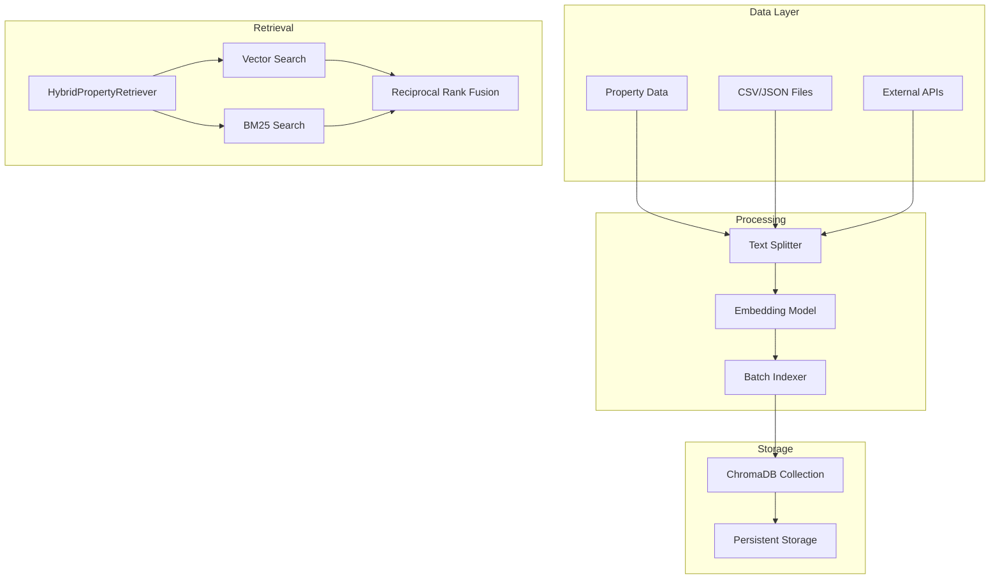
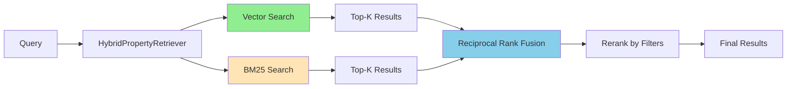
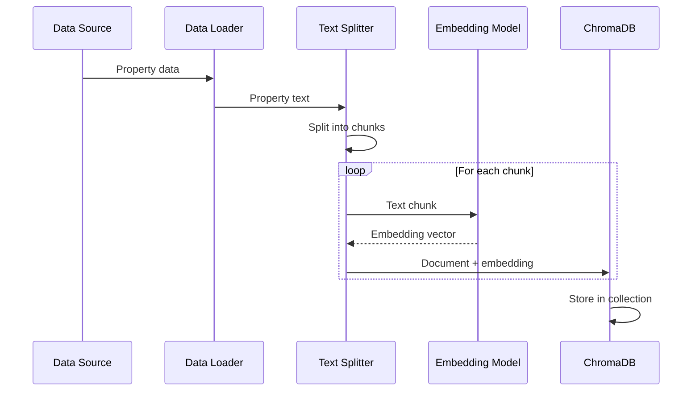

# Vector Store (ChromaDB Integration)

This document describes the ChromaDB vector store integration and hybrid retrieval system.

## Overview

The system uses ChromaDB as the vector store for semantic property search, with FastEmbed for efficient embeddings.

## Architecture Diagram



## ChromaPropertyStore

The main class for property storage and retrieval.

### Initialization

```python
from vector_store.chroma_store import ChromaPropertyStore

store = ChromaPropertyStore(
    persist_directory="./data/chroma",
    collection_name="properties",
    embedding_model="BAAI/bge-small-en-v1.5"  # FastEmbed model
)
```

### Configuration

| Setting | Default | Description |
|---------|---------|-------------|
| `persist_directory` | `./data/chroma` | Storage location |
| `collection_name` | `"properties"` | Collection name |
| `embedding_model` | `BAAI/bge-small-en-v1.5` | FastEmbed model |
| `batch_size` | `100` | Indexing batch size |

## Hybrid Retrieval System

The system uses a hybrid approach combining vector search and keyword search:

### Retrieval Architecture



### HybridPropertyRetriever

```python
class HybridPropertyRetriever(BaseRetriever):
    """
    Retriever that combines semantic and keyword search.
    """

    def _get_relevant_documents(
        self,
        query: str,
        filters: Optional[Dict[str, Any]] = None,
        k: int = 5
    ) -> List[Document]:
        # 1. Vector search (semantic)
        vector_results = self._vector_search(query, k=k*2)

        # 2. BM25 search (keyword)
        bm25_results = self._bm25_search(query, k=k*2)

        # 3. Reciprocal Rank Fusion
        fused = self._reciprocal_rank_fusion(
            vector_results,
            bm25_results,
            k=60
        )

        # 4. Apply filters
        if filters:
            fused = self._apply_filters(fused, filters)

        return fused[:k]
```

## Document Structure

Each property is stored as a document with the following structure:

```python
Document(
    page_content="""
    Property in Warsaw, Mokotów district.
    2 bedrooms, 1 bathroom, 55 sqm.
    Price: 450,000 PLN.
    Fully furnished, parking available.
    """,
    metadata={
        "property_id": "prop_123",
        "city": "Warsaw",
        "district": "Mokotów",
        "price": 450000,
        "rooms": 2,
        "area": 55,
        "has_parking": True,
        "is_furnished": True,
        "year_built": 2010,
        "energy_rating": "B"
    }
)
```

## Ingestion Pipeline



### Supported Data Formats

| Format | Source | Loader |
|--------|--------|--------|
| CSV | Local/Remote file | `CsvProvider` |
| JSON | Local/Remote file | `JsonProvider` |
| API | External REST API | `ApiProvider` |

### Ingestion Code

```python
# Ingest from CSV
from data.factory import DataProviderFactory

provider = DataProviderFactory.create_provider("csv", source="properties.csv")
properties = provider.get_properties()

store = ChromaPropertyStore()
store.add_properties(
    properties,
    chunk_size=500,
    chunk_overlap=50
)
```

## Filtering System

The retriever supports structured filtering alongside semantic search.

### Filter Types

| Filter | Type | Example |
|--------|------|---------|
| `city` | str | `"Warsaw"` |
| `min_price` | float | `300000` |
| `max_price` | float | `500000` |
| `rooms` | int | `2` |
| `year_built_min` | int | `2010` |
| `has_parking` | bool | `true` |
| `has_garden` | bool | `true` |
| `energy_ratings` | list | `["A", "B"]` |

### Filter Query Syntax

```python
# ChromaDB where clause
filters = {
    "city": "Warsaw",
    "max_price": 500000,
    "rooms": 2
}

# Converted to ChromaDB query
where = {
    "$and": [
        {"city": {"$eq": "Warsaw"}},
        {"price": {"$lte": 500000}},
        {"rooms": {"$eq": 2}}
    ]
}
```

### Filtered Search

```python
# Using the retriever with filters
results = retriever.search_with_filters(
    query="modern apartment",
    filters={
        "city": "Warsaw",
        "max_price": 500000,
        "has_parking": True
    },
    k=5
)
```

## Reciprocal Rank Fusion (RRF)

RRF combines results from multiple retrieval methods:

```python
def reciprocal_rank_fusion(
    results_list: List[List[Document]],
    k: int = 60
) -> List[Document]:
    """
    Combine multiple ranked lists using RRF.

    RRF(d) = sum(1 / (k + rank(d)))
    """
    scores = {}

    for results in results_list:
        for rank, doc in enumerate(results):
            doc_id = doc.metadata.get("property_id")
            if doc_id not in scores:
                scores[doc_id] = {"doc": doc, "score": 0}
            scores[doc_id]["score"] += 1 / (k + rank + 1)

    # Sort by score
    ranked = sorted(
        scores.values(),
        key=lambda x: x["score"],
        reverse=True
    )

    return [item["doc"] for item in ranked]
```

## Embedding Models

### FastEmbed Models

| Model | Dimensions | Speed | Quality |
|-------|------------|-------|---------|
| BAAI/bge-small-en-v1.5 | 384 | Fast | Good |
| BAAI/bge-base-en-v1.5 | 768 | Medium | Better |
| BAAI/bge-large-en-v1.5 | 1024 | Slow | Best |

### OpenAI Embeddings

```python
# Alternative: Use OpenAI embeddings
from langchain_openai import OpenAIEmbeddings

embeddings = OpenAIEmbeddings(
    model="text-embedding-3-small",
    dimensions=1536
)
```

## Persistence

ChromaDB persists data to disk:


### Storage Location

```
./data/chroma/
├── chroma.sqlite3          # Metadata
└── properties/             # Collection data
    ├── data_level0.bin
    ├── header.bin
    ├── length.bin
    └── ...
```

## Performance Optimization

### Batch Indexing

```python
# Index in batches for better performance
store.add_properties(
    properties,
    batch_size=100,
    num_threads=4
)
```

### Caching

```python
# Enable caching for faster retrieval
from functools import lru_cache

@lru_cache(maxsize=100)
def get_retriever():
    return ChromaPropertyStore().get_retriever()
```

## Monitoring

### Collection Statistics

```python
stats = store.get_collection_stats()
# {
#     "count": 1523,
#     "embed_dim": 384,
#     "metadata_fields": ["city", "price", "rooms", ...]
# }
```

### Query Performance

```python
import time

start = time.time()
results = retriever.get_relevant_documents(query)
duration = time.time() - start

logger.info(f"Query took {duration:.3f}s, returned {len(results)} results")
```

## File Locations

| Component | File |
|-----------|------|
| ChromaPropertyStore | `apps/api/vector_store/chroma_store.py` |
| HybridPropertyRetriever | `apps/api/vector_store/chroma_store.py` |
| Knowledge Store | `apps/api/vector_store/knowledge_store.py` |
| Data Providers | `apps/api/data/factory.py` |
| Data Schemas | `apps/api/data/schemas.py` |

## API Endpoints

| Endpoint | Method | Description |
|----------|--------|-------------|
| `/api/v1/rag/upload` | POST | Upload documents |
| `/api/v1/rag/qa` | POST | Query documents |
| `/api/v1/rag/reset` | POST | Clear collection |
| `/api/v1/admin/reindex` | POST | Reindex all data |
| `/api/v1/search` | POST | Property search with filters |
