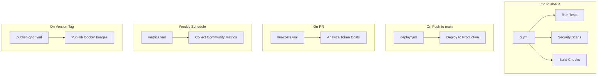
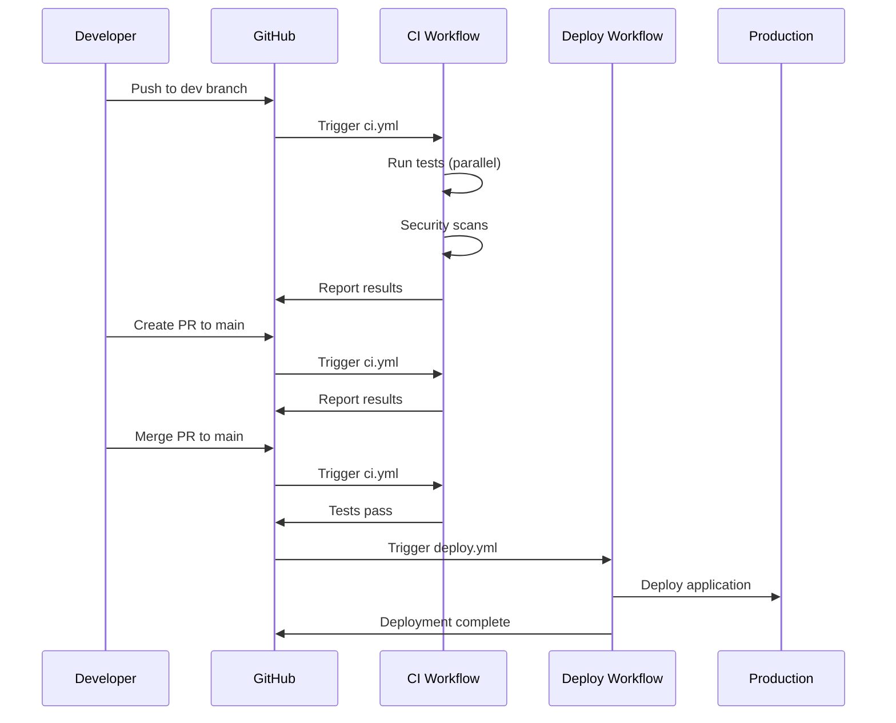

# GitHub Workflows Guide

## Overview

This project uses 5 GitHub Actions workflows for CI/CD automation:



---

## 1. ci.yml - Main CI/CD Pipeline

**Purpose:** Continuous Integration with parallel test execution

**Triggers:**
- Push to `main`, `dev`, `ver4` branches
- Pull requests to `main`, `dev`, `ver4`
- Manual workflow dispatch

**What it does:**

### Stage 1: Quick Checks (Parallel)
- **Gitleaks** - Scan for secrets in code
- **Secret validation** - Check for placeholder secrets in configs
- **Backend lint** - Ruff linting
- **Backend typecheck** - MyPy type checking

### Stage 2: Backend Tests (9 Parallel Jobs)
Tests are split by module for maximum parallelization:
- `unit-agents` - Agent tests
- `unit-analytics` - Analytics tests
- `unit-api` - API tests
- `unit-core` - Core functionality tests
- `unit-models` - Model tests
- `unit-services` - Service tests
- `unit-tools` - Tool tests
- `unit-utils` - Utility tests
- `integration` - Integration tests

Each job runs independently on separate GitHub Actions runners.

### Stage 3: Backend Validation
- RuleEngine test
- Forbidden tokens scan
- OpenAPI breaking-change detection
- Alembic migration check

### Stage 4: Frontend Tests
- Lint (ESLint)
- Unit tests (Jest)
- Coverage reports

### Stage 5: Security Scans (Parallel)
- **Bandit** - Python security scanner
- **Semgrep** - Static analysis
- **pip-audit** - Dependency vulnerability scanner

### Stage 6: Summary
- Aggregate results from all jobs
- Report overall status

**Performance:**
- **Sequential (old):** ~18-25 minutes
- **Parallel (new):** ~5-8 minutes
- **Speedup:** 3-4x faster

**Configuration:**
```yaml
concurrency:
  group: ci-${{ github.ref }}
  cancel-in-progress: true  # Cancel old runs on new push
```

---

## 2. deploy.yml - Production Deployment

**Purpose:** Deploy application to production/staging environments

**Triggers:**
- Push to `main` branch (automatic)
- Manual workflow dispatch with environment selection

**What it does:**

### Validation
- Checkout code
- Verify deployment configuration
- Check environment variables

### Deploy API
- Deploy backend to Render.com
- Wait for deployment to complete
- Verify health endpoint

### Deploy Web
- Deploy frontend to Render.com
- Wait for deployment to complete
- Verify application is accessible

### Post-Deployment
- Run smoke tests
- Send notifications (if configured)

**Target Platforms:**
- **Production:** Render.com
- **Staging:** Render.com (separate service)

**Environment Variables Required:**
- `RENDER_SERVICE_ID_API` - Backend service ID
- `RENDER_SERVICE_ID_WEB` - Frontend service ID
- `RENDER_API_KEY` - Render.com API key

**Manual Deployment:**
```bash
# Via GitHub UI
Actions → Deploy to Production → Run workflow
Select environment: production/staging
```

---

## 3. llm-costs.yml - LLM Cost Analysis

**Purpose:** Analyze and report LLM token usage costs in pull requests

**Triggers:**
- Pull requests to `main` or `master` branches

**What it does:**

### Analysis
- Checkout PR code
- Scan for LLM API calls
- Calculate token usage
- Estimate costs based on provider pricing

### Reporting
- Post comment on PR with cost breakdown
- Show token counts by model
- Compare with baseline
- Flag significant cost increases

**Tool Used:**
- [tokentoll](https://github.com/Jwrede/tokentoll) v0.6.1

**Example Output:**
```
💰 LLM Cost Analysis

Total Tokens: 15,234
Estimated Cost: $0.23

Breakdown:
- GPT-4: 5,000 tokens ($0.15)
- GPT-3.5: 10,234 tokens ($0.08)

⚠️ Cost increased by 15% compared to main branch
```

**Benefits:**
- Track LLM costs before merging
- Identify expensive operations
- Optimize token usage
- Budget planning

---

## 4. metrics.yml - Community Metrics

**Purpose:** Collect and track project health metrics

**Triggers:**
- Weekly schedule (Monday 09:00 UTC)
- Manual workflow dispatch

**What it does:**

### Data Collection
- **GitHub Stats:**
  - Stars, forks, watchers
  - Open/closed issues
  - Open/closed PRs
  - Contributors count
  - Commit activity

- **Code Metrics:**
  - Lines of code
  - Test coverage
  - Code quality scores

- **Community Metrics:**
  - New contributors
  - Issue response time
  - PR merge time
  - Community engagement

### Storage
- Save metrics to repository
- Generate trend reports
- Create visualizations

### Reporting
- Update README badges
- Generate weekly summary
- Track growth over time

**Output Files:**
- `metrics/weekly/YYYY-MM-DD.json` - Raw metrics
- `metrics/trends.md` - Trend analysis
- `metrics/charts/` - Visualizations

**Benefits:**
- Track project health
- Identify growth trends
- Community engagement insights
- Data-driven decisions

---

## 5. publish-ghcr.yml - Docker Image Publishing

**Purpose:** Build and publish Docker images to GitHub Container Registry

**Triggers:**
- Version tags (e.g., `v1.0.0`, `v2.1.3`)
- Manual workflow dispatch

**What it does:**

### Build Backend Image
- Checkout code
- Set up Docker Buildx
- Build backend Docker image
- Tag with version number
- Push to `ghcr.io/[owner]/[repo]/backend`

### Build Frontend Image
- Build frontend Docker image
- Tag with version number
- Push to `ghcr.io/[owner]/[repo]/frontend`

### Multi-Platform Support
- Build for `linux/amd64`
- Build for `linux/arm64`
- Support for different architectures

**Image Tags:**
- `latest` - Latest stable release
- `v1.0.0` - Specific version
- `main` - Latest from main branch (optional)

**Usage:**
```bash
# Pull images
docker pull ghcr.io/[owner]/[repo]/backend:latest
docker pull ghcr.io/[owner]/[repo]/frontend:latest

# Run containers
docker run -p 8000:8000 ghcr.io/[owner]/[repo]/backend:latest
docker run -p 3000:3000 ghcr.io/[owner]/[repo]/frontend:latest
```

**Publishing a Release:**
```bash
# Create and push version tag
git tag v1.0.0
git push origin v1.0.0

# Workflow automatically builds and publishes images
```

**Benefits:**
- Automated image publishing
- Version tracking
- Easy deployment
- Multi-platform support

---

## Workflow Execution Flow



---

## Workflow Status Badges

Add these to your README.md:

```markdown
[](https://github.com/[owner]/[repo]/actions/workflows/ci.yml)
[](https://github.com/[owner]/[repo]/actions/workflows/deploy.yml)
```

---

## Troubleshooting

### CI Workflow Fails

**Check:**
1. Test failures - Review test logs
2. Linting errors - Run `ruff check .` locally
3. Type errors - Run `mypy .` locally
4. Security issues - Check Bandit/Semgrep reports

**Fix:**
```bash
# Run tests locally
.\scripts\testing\test-ci.ps1

# Fix linting
ruff check . --fix

# Fix type errors
mypy . --explicit-package-bases
```

### Deploy Workflow Fails

**Check:**
1. Environment variables set correctly
2. Render.com service IDs valid
3. API key has correct permissions
4. Health endpoint responding

**Fix:**
```bash
# Verify environment variables in GitHub Settings
Settings → Secrets and variables → Actions

# Test deployment locally
docker compose up --build
```

### Metrics Workflow Fails

**Check:**
1. GitHub token permissions
2. Repository access
3. Metrics directory exists

**Fix:**
```bash
# Create metrics directory
mkdir -p metrics/weekly

# Run manually
Actions → Community Metrics → Run workflow
```

---

## Best Practices

### For Developers

1. **Run tests locally before pushing:**
   ```bash
   .\scripts\testing\test-ci.ps1
   ```

2. **Check CI status before merging PR**

3. **Review LLM cost analysis in PRs**

4. **Tag releases properly:**
   ```bash
   git tag -a v1.0.0 -m "Release v1.0.0"
   git push origin v1.0.0
   ```

### For Maintainers

1. **Monitor workflow execution times**
2. **Review security scan results weekly**
3. **Update dependencies regularly**
4. **Check metrics trends monthly**
5. **Optimize slow tests**

---

## Configuration Files

### Workflow Files
- `.github/workflows/ci.yml` - Main CI
- `.github/workflows/deploy.yml` - Deployment
- `.github/workflows/llm-costs.yml` - Cost analysis
- `.github/workflows/metrics.yml` - Metrics collection
- `.github/workflows/publish-ghcr.yml` - Docker publishing

### Related Files
- `.github/dependabot.yml` - Dependency updates
- `.github/CODEOWNERS` - Code ownership
- `.pre-commit-config.yaml` - Pre-commit hooks
- `pytest.ini` - Pytest configuration
- `pyproject.toml` - Python project config

---

## Performance Metrics

| Workflow | Avg Duration | Parallelization | Cost (GitHub Actions) |
|----------|--------------|-----------------|----------------------|
| ci.yml | 5-8 min | 9 parallel jobs | ~$0.10 per run |
| deploy.yml | 3-5 min | Sequential | ~$0.05 per run |
| llm-costs.yml | 1-2 min | N/A | ~$0.02 per run |
| metrics.yml | 2-3 min | N/A | ~$0.03 per run |
| publish-ghcr.yml | 10-15 min | 2 parallel builds | ~$0.15 per run |

**Total monthly cost estimate:** ~$50-100 (depending on activity)

---

## Future Improvements

- [ ] Add E2E tests to CI workflow
- [ ] Implement canary deployments
- [ ] Add performance benchmarking
- [ ] Integrate with monitoring tools
- [ ] Add automatic rollback on deployment failure
- [ ] Implement blue-green deployments
- [ ] Add load testing in staging
- [ ] Integrate with Slack/Discord notifications

---

## Related Documentation

- [Testing Guide](../testing/TESTING_GUIDE.md)
- [Deployment Guide](../deployment/DEPLOYMENT.md)
- [Contributing Guide](../development/CONTRIBUTING.md)
- [Architecture](../ARCHITECTURE.md)

---

**Last Updated:** 2026-05-10
**Version:** 1.0.0
