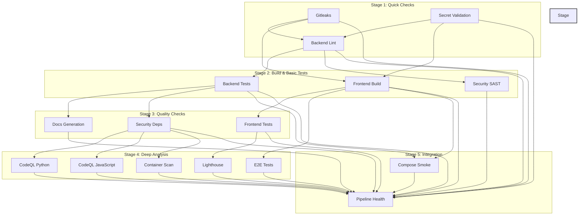

# CI/CD Pipeline Documentation

This guide covers the GitHub Actions CI/CD pipeline for the AI Real Estate Assistant project.

## Table of Contents

- [Overview](#overview)
- [Pipeline Architecture](#pipeline-architecture)
- [Progressive Security Model](#progressive-security-model)
- [Stages and Jobs](#stages-and-jobs)
- [Manual Workflow Dispatch](#manual-workflow-dispatch)
- [Local CI Parity](#local-ci-parity)
- [Pipeline Maintenance](#pipeline-maintenance)
- [Troubleshooting](#troubleshooting)

---

## Overview

The CI/CD pipeline is defined in `.github/workflows/ci.yml` and runs on:

- **Push to branches**: `main`, `dev`, or `ver4`
- **Pull requests**: Targeting `main`, `dev`, or `ver4`
- **Manual dispatch**: Via GitHub Actions UI with optional deep analysis toggle

### Pipeline Goals

1. **Security**: Detect secrets and vulnerabilities on ALL branches
2. **Quality**: Enforce code style and type safety
3. **Testing**: Verify functionality with coverage gates
4. **Progressive Depth**: Quick feedback on dev, comprehensive validation on main
5. **Efficiency**: Sequential execution fails fast on early issues

### Key Features

- **Sequential Execution**: Jobs run in stages using `needs` dependencies
- **Fail-Fast**: Early stage failures prevent wasting CI resources
- **Progressive Security**: Basic checks on all branches, deep analysis on main
- **Manual Override**: Can enable comprehensive checks on dev via workflow dispatch

---

## Pipeline Architecture

The pipeline uses a **5-stage sequential design** where jobs execute in order. Later stages only run if earlier stages succeed.



### Branch-Specific Behavior

| Stage | Dev | Main/Ver4 | Manual Dispatch |
|-------|-----|-----------|------------------|
| **Stage 1**: Quick Checks | ✅ Always | ✅ Always | ✅ Always |
| **Stage 2**: Build & Tests | ✅ Always | ✅ Always | ✅ Always |
| **Stage 3**: Quality | ✅ Always | ✅ Always | ✅ Always |
| **Stage 4**: Deep Analysis | ❌ Skipped | ✅ Always | ✅ Optional |
| **Stage 5**: Integration | ✅ Always | ✅ Always | ✅ Always |

**Expected Duration**:
- Dev branch: ~8-12 minutes (Stages 1-3 + 5)
- Main/ver4: ~15-25 minutes (All stages)
- Manual with deep analysis on dev: ~15-25 minutes

---

## Progressive Security Model

The pipeline implements a **progressive security approach** where ALL branches receive security scanning, but depth varies by branch context.

### Security Coverage by Branch

| Security Type | Dev | Main/Ver4 | Rationale |
|---------------|-----|-----------|------------|
| **Secret Scanning** | ✅ | ✅ | Critical for all branches |
| **SAST (Bandit, Semgrep)** | ✅ | ✅ | Fast static analysis |
| **Dependency Scanning (pip-audit)** | ✅ | ✅ | Catch vulnerable deps early |
| **CodeQL Analysis** | ❌ | ✅ | Expensive deep analysis (~10 min) |
| **Container Scanning (Trivy)** | ❌ | ✅ | Deployment readiness |
| **Performance Audit (Lighthouse)** | ❌ | ✅ | Production UX standards |
| **E2E Testing** | ❌ | ✅ | Full regression testing |

### Why This Model?

1. **Dev Branch**: Fast feedback loop for active development
   - Catch secrets, basic security issues, and quality problems quickly
   - Don't wait for expensive deep analysis on every commit
   - Enable Stage 4 manually when needed for pre-merge validation

2. **Main/Ver4 Branches**: Comprehensive validation before production
   - Full security scanning including CodeQL's deep analysis
   - Container vulnerability scanning for deployment safety
   - Performance and E2E testing for production readiness
   - Ensures only validated code reaches production

3. **Manual Dispatch**: Flexibility for special cases
   - Enable deep analysis on dev for critical features before merging
   - Useful for pre-merge validation of sensitive changes
   - Allows testing Stage 4 fixes without pushing to main

---

## Stages and Jobs

### Stage 1: Quick Checks

**Purpose**: Fail fast on fundamental issues (secrets, basic linting)

**Duration**: ~1-2 minutes

#### Gitleaks

Detects committed secrets (API keys, tokens, passwords).

**Config**: `.gitleaks.toml`

**Excludes**:
- `.env.example` (example values)
- `*.test.js`, `*.spec.ts` (test files)

**On Failure**:
- Review the leaked secret
- Rotate the secret immediately
- Remove from git history (git filter-repo or BFG)
- Update `.gitleaks.toml` if false positive

#### Secret Validation

Detects placeholder secrets in deployment configurations.

**Checks**: Docker compose files, Kubernetes manifests, deployment scripts

**On Failure**:
- Replace placeholder with actual secret
- Ensure secrets are properly externalized

#### Backend Lint

Fast Python linting and type checking (no tests).

**Steps**:
1. Install dependencies (uv with caching)
2. Lint (ruff check)
3. Type check (mypy)

**Duration**: ~30-60 seconds

---

### Stage 2: Build & Basic Tests

**Purpose**: Build artifacts and run core test suites

**Duration**: ~5-8 minutes

#### Backend Tests

Comprehensive Python testing pipeline.

**Steps**:
1. Install dependencies (with caching)
2. Rule engine test
3. Forbidden token scan
4. OpenAPI schema drift check
5. API reference drift check
6. Unit tests with coverage
7. Coverage gates (diff + critical)
8. Integration tests with coverage

**Coverage Gates**:

| Gate | Minimum | Scope |
|------|---------|-------|
| Unit Diff | 90% | Changed files only |
| Unit Critical | 90% | Core modules |
| Integration Diff | 70% | Changed files only |

**Critical Modules**:
- `api/*.py`
- `api/routers/*.py`
- `rules/*.py`
- `models/provider_factory.py`
- `models/user_model_preferences.py`
- `config/*.py`

#### Frontend Build

Build frontend and run basic linting.

**Steps**:
1. Install dependencies (npm ci with caching)
2. Lint (ESLint)
3. Build (next build)

**Duration**: ~2-3 minutes

#### Security SAST

Fast static application security testing.

**Tools**: Bandit (Python), Semgrep (custom rules)

**Scans**:
- SQL injection patterns
- XSS vulnerabilities
- Command injection
- Insecure deserialization

**Duration**: ~1-2 minutes

**Excluded**: `tests/`, `node_modules/`, `.history/`, `venv/`

---

### Stage 3: Quality Checks

**Purpose**: Validate code quality and dependency safety

**Duration**: ~3-5 minutes

#### Frontend Tests

JavaScript/TypeScript testing with coverage.

**Coverage Requirements**:
- Lines: ≥85%
- Statements: ≥85%
- Functions: ≥85%
- Branches: ≥70%

**Duration**: ~1-2 minutes

#### Docs Generation

Generate and validate API documentation.

**Steps**:
1. Generate OpenAPI schema
2. Generate API reference docs
3. Check for drift from baseline

**On Failure**: Docs are out of sync with code - regenerate locally

#### Security Deps

Dependency vulnerability scanning.

**Tools**: pip-audit (Python), npm audit (JavaScript)

**Fail Condition**: Vulnerabilities found (continue-on-error in CI)

**Report**: Uploaded as artifact

**Duration**: ~30-60 seconds

---

### Stage 4: Deep Analysis

**Purpose**: Comprehensive security, performance, and integration validation

**Duration**: ~8-12 minutes

**Runs On**: `main`, `ver4`, or manual dispatch with deep analysis enabled

#### CodeQL Python

Deep static analysis for Python security issues.

**Queries**: security-extended, security-and-quality

**Excluded Paths**:
- `**/node_modules`
- `**/.next`
- `**/dist`
- `**/build`
- `**/coverage`
- `**/__pycache__`
- `**/venv`
- `**/.venv`
- `**/.venv_ci`
- `**/*.test.js`
- `**/*.test.ts`
- `**/*.test.tsx`
- `**/*.spec.js`
- `**/*.spec.ts`
- `**/*.spec.tsx`
- `**/tests/**`

**Duration**: ~5-8 minutes

#### CodeQL JavaScript

Deep static analysis for TypeScript/JavaScript.

**Config**: Same exclusions as Python

**Duration**: ~3-5 minutes

#### Container Scan

Container vulnerability scanning using Trivy.

**Images**:
- Backend: `deploy/docker/Dockerfile.backend`
- Frontend: `deploy/docker/Dockerfile.frontend`

**Severity**: CRITICAL and HIGH only

**Unfixed**: Ignored (configuration bugs, not malicious)

**Duration**: ~2-3 minutes

#### Lighthouse

Performance, accessibility, and SEO audit.

**Scans**: Frontend application

**Thresholds**:
- Performance: ≥90
- Accessibility: ≥90
- SEO: ≥80
- Best Practices: ≥90

**Duration**: ~1-2 minutes

#### E2E Tests

End-to-end testing with Playwright.

**Tests**: Critical user flows (search, auth, favorites)

**Duration**: ~3-5 minutes

---

### Stage 5: Integration

**Purpose**: Validate system integration and summarize results

**Duration**: ~5-10 minutes

#### Compose Smoke

Docker Compose smoke test.

**Steps**:
1. Build Docker images
2. Start containers
3. Wait for health checks
4. Verify services respond

**Timeout**: 10 minutes

**Retry**: Once on failure (for transient issues)

#### Pipeline Health

Final summary job that:
- Aggregates all job results
- Posts summary to GitHub run summary
- Creates/fails based on job results
- Reports non-success jobs

---

## Manual Workflow Dispatch

The pipeline supports manual execution via GitHub Actions UI with optional parameters.

### How to Trigger

1. Go to **Actions** tab in GitHub
2. Select **"CI/CD AI Real Estate Assistant"** workflow
3. Click **"Run workflow"**
4. Select branch (dev, main, or ver4)
5. **Optional**: Enable **"Enable Stage 4 deep analysis"**
6. Click **"Run workflow"**

### Use Cases

#### Enable Deep Analysis on Dev

When you want comprehensive validation on dev before merging to main:

1. Trigger workflow on `dev` branch
2. Enable **"Enable Stage 4 deep analysis"**
3. Review results including CodeQL, Trivy, Lighthouse, E2E

**When to Use**:
- Before merging critical security changes
- When testing Stage 4 fixes
- Pre-merge validation for sensitive features
- Full regression testing without pushing to main

#### Quick Validation on Main

When you want fast feedback without deep analysis:

1. Trigger workflow on `main` branch
2. **Disable** **"Enable Stage 4 deep analysis"**
3. Only Stages 1-3, 5 will run

**When to Use**:
- Quick hotfix validation
- Documentation-only changes
- Configuration updates

---

## Local CI Parity

Run the full CI pipeline locally before pushing.

### Quick CI

```bash
make ci-quick
```

Runs: Lint, type check, quick tests (skips slower scans).

### Full CI

```bash
make ci
```

Or:

```bash
python scripts/workflows/full_ci.py
```

### Manual CI Reproduction

#### Backend CI

```powershell
# Install uv
pip install uv

# Install dependencies
uv pip install -e .[dev]

# Lint
python -m ruff check .

# Type check
python -m mypy

# Rule engine test
python -m pytest -q tests/integration/test_rule_engine_clean.py

# OpenAPI schema check
python scripts/docs/export_openapi.py --check

# API reference check
python scripts/docs/generate_api_reference.py --check

# Unit tests with coverage
python -m pytest tests/unit --cov=. --cov-report=xml --cov-report=term -n auto

# Coverage gates
python scripts/ci/coverage_gate.py diff --coverage-xml coverage.xml --min-coverage 90 --exclude tests/* --exclude scripts/* --exclude workflows/*
python scripts/ci/coverage_gate.py critical --coverage-xml coverage.xml --min-coverage 90 --include api/*.py --include api/routers/*.py --include rules/*.py --include models/provider_factory.py --include models/user_model_preferences.py --include config/*.py

# Integration tests
python -m pytest tests/integration --cov=. --cov-report=xml --cov-report=term
```

#### Frontend CI

```powershell
cd apps/web

# Install dependencies
npm ci

# Lint
npm run lint

# Tests with coverage
npm run test:ci
```

#### Security CI

```powershell
# Install tools
uv pip install bandit pip-audit

# Bandit
python -m bandit -r apps/api -x tests,node_modules,.history,venv --severity-level high --confidence-level high -f json -o artifacts/bandit.json

# pip-audit
python -m pip_audit -r requirements.txt -f json -o artifacts/pip-audit.json

# Semgrep (requires installation)
semgrep scan --config semgrep.yml --error
```

#### CodeQL CI (Stage 4)

```bash
# Requires CodeQL CLI installation
# See: https://codeql.github.com/docs/codeql-cli/

# Python analysis
codeql database create .codeql-db --language=python
codeql database analyze .codeql-db javascript-typescript:security-extended,security-and-quality --format=sarif-latest --output=python-results.sarif

# JavaScript analysis
codeql database create .codeql-db-js --language=javascript-typescript
codeql database analyze .codeql-db-js javascript-typescript:security-extended,security-and-quality --format=sarif-latest --output=javascript-results.sarif
```

---

## Pipeline Maintenance

### Review Pipeline Health

Pipeline health issues are created when jobs fail.

```bash
# List recent runs
gh run list -R AleksNeStu/ai-real-estate-assistant --limit 10

# View specific run
gh run view -R AleksNeStu/ai-real-estate-assistant <run_id>

# View failed logs
gh run view -R AleksNeStu/ai-real-estate-assistant <run_id> --log-failed
```

### Re-run Failed Jobs

```bash
# Re-run specific job
gh run rerun -R AleksNeStu/ai-real-estate-assistant <run_id>

# Re-run all failed jobs
gh run rerun -R AleksNeStu/ai-real-estate-assistant <run_id> --failed
```

### Update Dependencies

For flaky tests due to dependency updates:

```bash
# Update Python dependencies
cd apps/api
uv pip install --upgrade <package>
pip freeze > requirements.txt

# Update Node dependencies
cd apps/web
npm update <package>
npm install
```

### Coverage Gate Adjustments

To adjust coverage thresholds:

1. Edit `scripts/ci/coverage_gate.py` or CI workflow
2. Document rationale in commit message
3. Get team approval for reduced thresholds

---

## Troubleshooting

### Issue: Integration Test Flake

**Symptom:** Tests pass locally, fail in CI intermittently.

**Cause:** Async indexing racing with shared in-memory Chroma state.

**Solution:**
- CI retries integration tests once automatically
- Consider using file-backed Chroma for tests
- Add explicit waits in tests

### Issue: Coverage Gate Failure

**Symptom:** New code doesn't meet coverage requirements.

**Solution:**
```bash
# Check coverage locally
pytest tests/unit --cov=. --cov-report=html
open htmlcov/index.html

# Find uncovered lines and write tests
```

### Issue: Docker Build Timeout

**Symptom:** `compose_smoke` job times out.

**Cause:** Slow build or health check failure.

**Solution:**
- Check logs in GitHub Actions
- Verify health check endpoints
- Consider increasing timeout in workflow

### Issue: Gitleaks False Positive

**Symptom:** Legitimate value flagged as secret.

**Solution:**
```toml
# In .gitleaks.toml
[[rules.allowlist]]
regex = '''your-pattern-here'''
```

### Issue: Semgrep Not Available

**Symptom:** `semgrep: command not found`.

**Solution:**
```bash
# Install Semgrep
python -m pip install semgrep

# Or use Docker
docker pull returntocorp/semgrep
```

### Issue: npm EPERM on Windows

**Symptom:** `npm ci` fails with EPERM.

**Solution:**
```powershell
# Delete node_modules and reinstall
Remove-Item -Recurse -Force apps/web/node_modules
cd apps/web
npm ci
```

### Issue: CodeQL Job Skipped on Dev

**Symptom:** Stage 4 jobs don't appear in workflow run on dev branch.

**Cause**: This is expected behavior - Stage 4 only runs on main/ver4 by design.

**Solution**:
- Use manual workflow dispatch with "Enable Stage 4 deep analysis" enabled
- Or push to main/ver4 for automatic Stage 4 execution

### Issue: Pipeline Runs Too Slow on Dev

**Symptom:** Dev branch takes too long to complete CI.

**Cause**: Running Stage 4 (deep analysis) on every commit.

**Solution**:
- Stage 4 should be skipped on dev (automatic)
- Only use manual dispatch when deep analysis is needed
- If Stage 4 is running automatically, check the `if:` condition in jobs

---

## Pipeline Optimization

### Sequential vs Parallel

The pipeline uses **sequential execution** with stage dependencies:

**Benefits**:
- Fail fast on early issues
- Don't waste resources on later stages if early stages fail
- Clear feedback loop for developers

**Trade-offs**:
- Total pipeline time is sum of all stages (not parallel)
- Acceptable because early stages are quick and catch most issues

### Caching Strategy

The pipeline uses GitHub Actions caching for:

| Cache | Key | Restore Keys |
|-------|-----|--------------|
| uv | `${{ runner.os }}-uv-${{ hashFiles(...) }}` | `${{ runner.os }}-uv-` |
| npm | `${{ runner.os }}-node-${{ hashFiles(...) }}` | `${{ runner.os }}-node-` |

### Retry Strategy

Jobs with automatic retry:

| Job | Retry Condition | Max Retries |
|-----|-----------------|-------------|
| backend-tests (integration) | Any failure | 1 |
| compose_smoke | Any failure | 1 |
| CodeQL analysis | continue-on-error | N/A (doesn't block) |

---

## Related Documentation

- [Testing Guide](testing.md)
- [Deployment Guide](deployment.md)
- [Troubleshooting Guide](troubleshooting.md)
- [Architecture Documentation](../architecture/)
